# ระบบจัดการพอร์ตการลงทุน (Investment Portfolio Management System)

ระบบบริหารพอร์ตการลงทุนสำหรับนักลงทุนรายบุคคล รองรับหุ้นและ ETF ในตลาดสหรัฐฯ (S&P 500, Dow Jones และ ETF หลัก) คิดมูลค่าเป็น USD
ผู้ใช้สร้างพอร์ต บันทึกการซื้อ-ขาย และติดตามกำไร/ขาดทุนได้ในที่เดียว พร้อมเครื่องมือวิเคราะห์ 5 ด้าน ได้แก่
**การวางสัดส่วนสินทรัพย์ (Asset Allocation), แนวรับ-แนวต้าน (Support/Resistance), แจ้งเตือนราคา (Price Alert),
เปรียบเทียบผลตอบแทนกับตลาด (Benchmark Comparison) และระบบรีบาลานซ์ (Rebalancing)**
พัฒนาด้วย Spring Boot แบบ Layered Architecture ตามหลัก SOLID และ Design Patterns สำหรับรายวิชา CP353002 Principles of Software Design and Development

---

## สมาชิกกลุ่ม

| ลำดับ | ชื่อ-นามสกุล | รหัสนักศึกษา | Section | Branch | หน้าที่ |
|:---:|---|---|:---:|---|---|
| 1 | นายรัฐภูมิ แฝงฤทธิ์หลง | 653308373-7 | 4 | `Ratthaphum_6533803737_04` | Tech lead |
| 2 | นางสาวชุตินันท์ หมายสุข | 673380401-6 | 4 | `Chutinan_6733804016_04` | Transactions |
| 3 | นายธนพัฒน์ พิมจำปา |673380404-0| 4 | `Thanaphat_6733804040_04` | DevOps |
| 4 | นางสาวภัทราพร ศรีชนะ | 673380419-7 | 4 | `Phattaraporn_6733804197_04` | Frontend |
| 5 | นายกิตติพัฒน์ สีราช | 673380393-9  | 4 | `kittipat_6733803939_04` | Testing / QA |


---

## ฟีเจอร์หลัก

| ฟีเจอร์ | รายละเอียด |
|---|---|
| หน้าหลัก 3 คอลัมน์ | พอร์ตทั้งหมด (มูลค่า/กำไร) · กระดานเทรด (แท่งเทียน/Heikin Ashi, MA20/50/200, RSI, MACD) · Watchlist (% รายวันสีเขียว/แดง) |
| 1. Asset Allocation | Donut chart สัดส่วนปัจจุบัน, กำหนดสัดส่วนเป้าหมาย, เปรียบเทียบปัจจุบัน vs เป้าหมาย (3 วิธีคำนวณ) |
| 2. Support/Resistance | คำนวณแนวรับ-แนวต้านแบบ Pivot Point และ Moving Average Band แสดงบนกราฟ |
| 3. Price Alert | ตั้งแจ้งเตือนเมื่อราคาสูง/ต่ำกว่าเป้า ระบบตรวจอัตโนมัติเป็นระยะ |
| 4. Benchmark Comparison | เปรียบเทียบผลตอบแทนของพอร์ตกับดัชนี S&P 500 หรือ Dow Jones ในช่วงเวลาที่เลือก |
| 5. Rebalancing | คำนวณแผนซื้อ-ขาย (Threshold / Calendar) ดูตัวอย่างก่อนยืนยัน และบันทึกประวัติ |
| อื่น ๆ | สมัครสมาชิก/เข้าสู่ระบบ (JWT), ค้นหาหุ้นแบบ Auto-complete จากรายชื่อ S&P 500 + ETF 69 ตัว (572 รายการ) ถ้าไม่พบค้นต่อจาก Yahoo Finance ให้เจอหุ้นทุกตัวในตลาดสหรัฐฯ, เพิ่มหุ้นจากหน้าพอร์ตได้ทันที, สลับแสดงมูลค่าเป็นเงินบาท (USD/THB) จาก navbar, แก้ไข/ลบรายการซื้อขายย้อนหลัง (คำนวณจำนวนหุ้นและต้นทุนเฉลี่ยใหม่ให้อัตโนมัติ) |

---

## Tech Stack

| ส่วน | เทคโนโลยี |
|---|---|
| Backend | Java 25, Spring Boot 4.1.1, Spring Web MVC, Spring Security |
| Build Tool | Maven (มี Maven Wrapper `mvnw`) |
| Database | PostgreSQL (รันผ่าน Docker Compose) |
| ORM | Spring Data JPA / Hibernate 7 |
| Authentication | JWT (jjwt 0.12.6) + BCrypt |
| API Documentation | springdoc-openapi 3.1.1 (Swagger UI) |
| Frontend | React 18, Vite 5, React Router 6, Axios |
| Charts | TradingView Lightweight Charts 4.2.3, Recharts |
| Testing | JUnit 5, Mockito, Spring Boot Test |
| Market Data | Yahoo Finance (ราคาปิดรายวัน, ดัชนี `^GSPC` และ `^DJI`) + ข้อมูลจำลองเป็นทางสำรอง |
| Version Control | Git + GitHub |
| Deployment | Render + Neon PostgreSQL |

---

## System Architecture

ระบบแบ่งเป็น Layer ชัดเจน แต่ละ Layer เรียกได้เฉพาะ Layer ถัดลงไป และกฎนี้ถูกตรวจอัตโนมัติทุกครั้งที่รัน test (`LayeredArchitectureTest`)

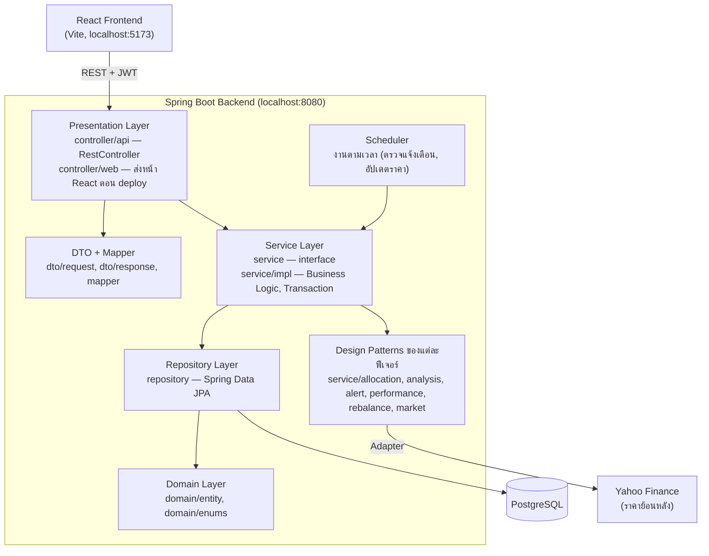
```mermaid
flowchart TD
    FE["React Frontend<br/>(Vite, localhost:5173)"] -->|REST + JWT| C
    subgraph Backend["Spring Boot Backend (localhost:8080)"]
        C["Presentation Layer<br/>controller/api — RestController<br/>controller/web — ส่งหน้า React ตอน deploy"]
        SC["Scheduler<br/>งานตามเวลา (ตรวจแจ้งเตือน, อัปเดตราคา)"]
        M["DTO + Mapper<br/>dto/request, dto/response, mapper"]
        S["Service Layer<br/>service — interface<br/>service/impl — Business Logic, Transaction"]
        P["Design Patterns ของแต่ละฟีเจอร์<br/>service/allocation, analysis, alert, performance, rebalance, market"]
        R["Repository Layer<br/>repository — Spring Data JPA"]
        D["Domain Layer<br/>domain/entity, domain/enums"]
        C --> M
        C --> S
        SC --> S
        S --> P
        S --> R --> D
    end
    R --> DB[(PostgreSQL)]
    P -->|Adapter| Y["Yahoo Finance<br/>(ราคาย้อนหลัง)"]
```

| กฎ | ความหมาย |
|---|---|
| Controller → Service interface เท่านั้น | ไม่เรียก Repository, ไม่รู้จัก `service/impl` หรือคลาส Strategy ตัวจริง, ไม่สร้าง/คืน Entity (แปลงผ่าน Mapper) |
| Scheduler → Service | งานตามเวลาเป็นจุดเริ่มงานเหมือน Controller จึงไม่แตะ Repository ตรง |
| Service ไม่รู้จัก Presentation | ไม่ import controller, dto หรือ mapper — คืนค่าเป็น Entity หรือ record ของ service เอง |
| Repository → Domain เท่านั้น | |
| Domain ไม่รู้จักชั้นอื่น | Entity และ Enum เป็นชั้นล่างสุด |
| DTO เป็นสัญญาของ API ล้วน ๆ | ใช้ได้แค่ Enum ไม่อ้าง Entity หรือ Service |

การเลือกวิธีคำนวณ (`?method=pivot`, `?method=threshold` ฯลฯ) ทำใน Service ผ่าน `common/StrategyRegistry` — เพิ่ม Strategy ใหม่ได้ด้วยการเพิ่มคลาสเดียว ไม่ต้องแก้ Controller

### Design Patterns ที่ใช้

| กลุ่ม | Pattern | ใช้ที่ |
|---|---|---|
| Enterprise | Layered Architecture, MVC, Repository, Service Layer, DTO + Mapper, Dependency Injection (Constructor) | ทั้งโปรเจกต์ |
| Behavioral | **Strategy** | `AllocationStrategy` (3 แบบ), `SupportResistanceStrategy` (2), `RebalanceStrategy` (2), `AlertConditionEvaluator` (2), `HoldingUpdateRule` (2) เลือกจากชื่อผ่าน `StrategyRegistry` |
| Behavioral | **Observer** | `AlertSubject` แจ้ง `EmailAlertNotifier`, `InAppAlertNotifier` |
| Behavioral | **State** | Price Alert: `PendingState` → `TriggeredState` (แจ้งเตือน) หรือ → `ExpiredState` (รอเกิน 90 วัน) |
| Behavioral | **Template Method** | `PerformanceReportTemplate` → `BenchmarkComparisonService` |
| Behavioral | **Command** | `BuyCommand`, `SellCommand` สร้างผ่าน `RebalanceCommands` ในการรีบาลานซ์ (ขายก่อนซื้อ) |
| Behavioral | **Chain of Responsibility** | ตรวจก่อนรีบาลานซ์ 3 ห่วง: `MinimumHoldingsValidationHandler` → `AllocationTargetsDefinedHandler` → `TargetSumValidationHandler` |
| Structural (เสริม) | **Adapter** | `YahooFinancePriceSource` (แปลงข้อมูล Yahoo เป็น `PriceBar`), `YahooSymbolSearch` (แปลงผลค้นหา Yahoo เป็น `SymbolInfo`), `ExternalMarketDataAdapter` |

รายละเอียดแต่ละ pattern และการวิเคราะห์ SOLID อยู่ที่ [`doc/design-patterns.md`](doc/design-patterns.md) และ [`doc/solid-analysis.md`](doc/solid-analysis.md)

---

## Database Design (ER Diagram)

PostgreSQL **13 ตาราง** ครอบคลุมความสัมพันธ์ครบทั้ง 3 แบบ:
- **One-to-One:** `users` — `user_profiles` (FK `user_id` มี UNIQUE)
- **One-to-Many:** `users` → `portfolios` → `holdings`, `transactions`, `price_alerts`, `allocation_targets`, `rebalance_logs` และ `assets` → `price_history`, `market_indices` → `index_price_history`
- **Many-to-Many:** `portfolios` ↔ `assets` ผ่าน join entity `holdings` (เก็บจำนวนและต้นทุนเฉลี่ย) และ `users` ↔ `assets` ผ่านตาราง `user_watchlist` (`@ManyToMany`)

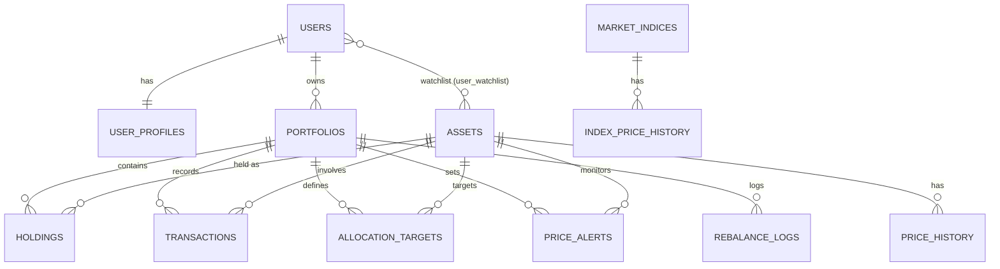
```mermaid
erDiagram
    USERS ||--|| USER_PROFILES : has
    USERS ||--o{ PORTFOLIOS : owns
    USERS }o--o{ ASSETS : "watchlist (user_watchlist)"
    PORTFOLIOS ||--o{ HOLDINGS : contains
    ASSETS ||--o{ HOLDINGS : "held as"
    PORTFOLIOS ||--o{ TRANSACTIONS : records
    ASSETS ||--o{ TRANSACTIONS : involves
    PORTFOLIOS ||--o{ ALLOCATION_TARGETS : defines
    ASSETS ||--o{ ALLOCATION_TARGETS : targets
    PORTFOLIOS ||--o{ PRICE_ALERTS : sets
    ASSETS ||--o{ PRICE_ALERTS : monitors
    PORTFOLIOS ||--o{ REBALANCE_LOGS : logs
    ASSETS ||--o{ PRICE_HISTORY : has
    MARKET_INDICES ||--o{ INDEX_PRICE_HISTORY : has
```

| หัวข้อ | สรุป |
|---|---|
| Constraints | ตั้งชื่อทุกตัว `pk_` / `fk_` / `uq_` / `ck_` — FK 15 ตัว, UNIQUE 9 ตัว, CHECK 17 ตัว (ค่า enum, จำนวน/ราคา > 0, เป้าหมาย 0–100%) |
| ON DELETE | **CASCADE** สำหรับข้อมูลที่เป็นของผู้ใช้/พอร์ต (ลบพอร์ตแล้วธุรกรรม, holding, alert หายตาม) · **RESTRICT** ห้ามลบ asset ที่ยังถูกถือหรือมีประวัติธุรกรรม |
| Fetch | `@ManyToOne` ทุกตัวเป็น `LAZY` (กัน N+1) · `@OneToMany`/`@OneToOne` ฝั่งแม่ใช้ `cascade = ALL, orphanRemoval = true` · `@ManyToMany` watchlist ไม่ cascade |
| Index | 10 index สำหรับ FK และ query ที่ใช้บ่อย เช่น `(portfolio_id, executed_at)` สำหรับประวัติธุรกรรม, `status` สำหรับ scheduler ตรวจ alert |
| Migration | [`schema.sql`](code/src/main/resources/schema.sql) (โครงสร้าง) + [`data.sql`](code/src/main/resources/data.sql) (ข้อมูลตัวอย่าง) รันซ้ำได้ · โปรไฟล์ `prod` รัน `schema.sql` แล้วให้ Hibernate `validate` · โปรไฟล์ `dev` ใช้ `ddl-auto: update` |

- ER Diagram แบบละเอียด (ทุกคอลัมน์ พร้อม PK/FK/UK): [`doc/diagrams/er-diagram.md`](doc/diagrams/er-diagram.md) · ภาพ [`er-diagram.png`](doc/diagrams/er-diagram.png)
- Data Dictionary ฉบับเต็ม (ชนิดข้อมูล, constraint, index และเหตุผลของ cascade/fetch): [`doc/data-dictionary.md`](doc/data-dictionary.md)

---

## Diagrams

คำอธิบายของทุกไดอะแกรมอยู่ที่ [`doc/diagrams/diagram_des.md`](doc/diagrams/diagram_des.md)

| ไดอะแกรม | ไฟล์ |
|---|---|
| ER Diagram | [`er-diagram.png`](doc/diagrams/er-diagram.png) · [`er-diagram.md`](doc/diagrams/er-diagram.md) |
| Use Case Diagram | [`01-use-case_.drawio.png`](doc/diagrams/01-use-case_.drawio.png) |
| Domain Model | [`02-domain-model__.png`](doc/diagrams/02-domain-model__.png) |
| Sequence: บันทึกซื้อหุ้น | [`03-sequence-buy.drawio.png`](doc/diagrams/03-sequence-buy.drawio.png) |
| Sequence: ตรวจแจ้งเตือนอัตโนมัติ | [`04-sequence-alert.drawio.png`](doc/diagrams/04-sequence-alert.drawio.png) |
| Sequence: ยืนยันรีบาลานซ์ | [`05-sequence-rebalance.drawio.png`](doc/diagrams/05-sequence-rebalance.drawio.png) |
| Component Diagram | [`07-component.drawio.png`](doc/diagrams/07-component.drawio.png) |
| Deployment Diagram | [`08-deployment.drawio.png`](doc/diagrams/08-deployment.drawio.png) |
| Class Diagram ของแต่ละ Design Pattern และ State Diagram ของ Price Alert | [`doc/design-patterns.md`](doc/design-patterns.md) |

---

## Installation & Setup

### สิ่งที่ต้องติดตั้งก่อน
- **JDK 25** (ต้องเป็น JDK ไม่ใช่ JRE — ตรวจด้วย `javac -version`)
- **Node.js 18+** และ npm
- **Docker Desktop** (สำหรับรัน PostgreSQL)
- Git

### ขั้นตอน
```bash
# 1. Clone repository
git clone https://github.com/OTTOxmessa/Project_PPD.git
cd Project_PPD

# 2. เปิดฐานข้อมูล PostgreSQL
cd code
docker compose up -d

# 3. ติดตั้ง dependency ของ Frontend
cd frontend
npm install
```

### การตั้งค่า
| ไฟล์ / ตัวแปร | ความหมาย |
|---|---|
| `code/src/main/resources/application-dev.yml` | การเชื่อมต่อฐานข้อมูลตอนพัฒนา (ค่าเริ่มต้นตรงกับ `docker-compose.yml`) |
| `JWT_SECRET` | คีย์สำหรับเซ็น JWT — **ต้องตั้งเป็น environment variable ตอน deploy** ห้ามใส่ค่าจริงในโค้ด |
| `DATABASE_URL`, `DB_USERNAME`, `DB_PASSWORD` | การเชื่อมต่อฐานข้อมูลตอน production (`application-prod.yml`) |

---

## How to Run

ต้องเปิด 2 terminal พร้อมกัน

```bash
# Terminal 1 — Backend (http://localhost:8080)
cd code
./mvnw clean spring-boot:run     # Windows CMD: mvnw.cmd clean spring-boot:run

# Terminal 2 — Frontend (http://localhost:5173)
cd code/frontend
npm run dev
```

เปิด http://localhost:5173 แล้วเข้าสู่ระบบด้วยบัญชีทดลอง

| อีเมล | รหัสผ่าน |
|---|---|
| `demo@portfolio.com` | `demo1234` |

บัญชีทดลองสร้างอัตโนมัติจาก `data.sql` ตอนเริ่มแอป พร้อมพอร์ตตัวอย่างสกุล USD 7 สินทรัพย์ (AAPL, MSFT, NVDA, JPM, KO, VOO, TLT) และ Watchlist

> **แหล่งข้อมูลราคา:** ระบบดึงราคาปิดรายวันจาก Yahoo Finance หลังเริ่มแอปและทุก 6 ชั่วโมง
> ถ้าเชื่อมต่อไม่ได้หรือไม่มีข้อมูลหุ้นตัวนั้น จะใช้ข้อมูลจำลองแทนและแสดงป้าย "จำลอง" บนหน้าจอ
> ข้อมูลจาก Yahoo Finance ใช้เพื่อการศึกษาเท่านั้น

---

## API Documentation

Swagger UI (เมื่อ backend รันอยู่): **http://localhost:8080/swagger-ui.html** · OpenAPI JSON: `/api-docs`

ทุก endpoint ยกเว้น `/api/v1/auth/**` ต้องแนบ header `Authorization: Bearer <token>`
ใน Swagger UI ให้เรียก `POST /api/v1/auth/login` ก่อน แล้วกดปุ่ม **Authorize** วาง token ที่ได้

### Endpoints

ตั้งชื่อแบบ Resource-based (คำนามพหูพจน์ ซ้อนตามความเป็นเจ้าของ เช่น `/portfolios/{id}/alerts/{alertId}`) ไม่มีคำกริยาใน URL

**Resource หลักที่มี CRUD ครบ:** Portfolios, Assets, Price Alerts

| Method | Endpoint | คำอธิบาย | Status |
|---|---|---|---|
| POST | `/api/v1/auth/register` | สมัครสมาชิก | 201, 400, 409 |
| POST | `/api/v1/auth/login` | เข้าสู่ระบบ (คืน JWT) | 200, 400, 401 |
| GET | `/api/v1/portfolios?page=0&size=10&sort=name,asc` | รายการพอร์ต (**Pagination & Sorting**) | 200 |
| POST | `/api/v1/portfolios` | สร้างพอร์ต | 201, 400 |
| GET · PUT · DELETE | `/api/v1/portfolios/{id}` | ดู / แก้ / ลบพอร์ต | 200, 204, 400, 404 |
| GET | `/api/v1/portfolios/summary` | มูลค่า/กำไรของทุกพอร์ต | 200 |
| GET | `/api/v1/portfolios/{id}/holdings` | สินทรัพย์ที่ถือพร้อมมูลค่าตลาด | 200, 404 |
| GET · POST | `/api/v1/portfolios/{id}/transactions` | ประวัติ / บันทึกการซื้อ-ขาย | 200, 201, 400, 404, 409 (ขายเกิน) |
| PUT · DELETE | `/api/v1/portfolios/{id}/transactions/{transactionId}` | แก้ / ลบรายการย้อนหลัง แล้วคำนวณจำนวนหุ้นและต้นทุนเฉลี่ยใหม่จากประวัติทั้งหมด | 200, 204, 400, 404, 409 (แก้/ลบแล้วจะขายเกินจำนวนที่ถือ ณ วันใดวันหนึ่ง) |
| GET | `/api/v1/portfolios/{id}/allocation?method=target\|equal\|risk` | สัดส่วนปัจจุบัน vs เป้าหมาย | 200, 400, 404 |
| GET · PUT | `/api/v1/portfolios/{id}/allocation/targets` | ดู / กำหนดสัดส่วนเป้าหมาย (ทีละตัว) | 200, 400 (รวมกันเกิน 100%), 404 |
| PUT | `/api/v1/portfolios/{id}/allocation/targets/bulk` | กำหนดเป้าหมายหลายตัวพร้อมกัน ตรวจผลรวมทั้งชุดไม่เกิน 100% | 200, 400 (รวมกันเกิน 100%), 404 |
| GET · POST | `/api/v1/portfolios/{id}/alerts` | รายการ / สร้างแจ้งเตือนราคา | 200, 201, 400, 404 |
| GET · PUT · DELETE | `/api/v1/portfolios/{id}/alerts/{alertId}` | ดู / แก้ / ลบแจ้งเตือน (แก้ได้เฉพาะสถานะ PENDING) | 200, 204, 400, 404, 409 |
| GET | `/api/v1/portfolios/{id}/performance?benchmark=SPX\|DJI&from=&to=` | เปรียบเทียบผลตอบแทนกับตลาด | 200, 400, 404 |
| GET | `/api/v1/portfolios/{id}/rebalance-plan?method=threshold\|calendar` | ดูแผนรีบาลานซ์ (ยังไม่ซื้อขายจริง) | 200, 400, 404 |
| POST | `/api/v1/portfolios/{id}/rebalances?method=` | รีบาลานซ์จริง สร้าง RebalanceLog ใหม่ | 201, 400, 404, 409 (พอร์ตยังไม่พร้อม) |
| GET | `/api/v1/portfolios/{id}/rebalances?page=&size=&sort=triggeredAt,desc` | ประวัติรีบาลานซ์ (**Pagination & Sorting**) | 200, 404 |
| GET · POST | `/api/v1/assets` | รายการ / เพิ่มสินทรัพย์ | 200, 201, 400, 409 (symbol ซ้ำ) |
| GET · PUT · DELETE | `/api/v1/assets/{id}` | ดู / แก้ / ลบสินทรัพย์ | 200, 204, 400, 404, 409 (ยังถูกใช้อยู่) |
| PUT | `/api/v1/assets/by-symbol/{symbol}` | หา หรือ สร้างสินทรัพย์จาก symbol (idempotent) | 200, 400 |
| GET | `/api/v1/assets/{id}/quote` | ราคาล่าสุด + % เปลี่ยนแปลงรายวัน | 200, 404 |
| GET | `/api/v1/assets/{id}/prices?from=&to=` | ราคาย้อนหลัง | 200, 400, 404 |
| GET | `/api/v1/assets/{id}/support-resistance?method=pivot\|ma&from=&to=` | แนวรับ-แนวต้าน | 200, 400, 404 |
| GET | `/api/v1/symbols/search?q=` | ค้นหาหุ้น (Auto-complete) | 200 |
| GET | `/api/v1/exchange-rates/usd-thb` | อัตรา USD/THB ล่าสุดสำหรับแสดงผลเป็นเงินบาท | 200, 503 (ยังดึงอัตราไม่ได้) |
| GET · POST | `/api/v1/watchlist` | รายการ / เพิ่มหุ้นที่ติดตาม | 200, 201 |
| DELETE | `/api/v1/watchlist/{assetId}` | เลิกติดตาม | 204 |

ทุก endpoint อาจตอบ **401** (ไม่มี token หรือ token หมดอายุ) และ **500** (ข้อผิดพลาดที่ไม่คาดคิด)

### Status Code

| Code | ใช้เมื่อ |
|---|---|
| 200 OK | อ่าน / แก้ไขสำเร็จ |
| 201 Created | สร้างข้อมูลใหม่สำเร็จ (POST) |
| 204 No Content | ลบสำเร็จ (DELETE) |
| 400 Bad Request | ไม่ผ่าน Bean Validation (`@Valid`), JSON ผิดรูปแบบ, พารามิเตอร์ผิดชนิด, ชื่อ Strategy ที่ไม่รู้จัก |
| 401 Unauthorized | ไม่มี token / token ไม่ถูกต้อง / login ผิด (ตอบข้อความเดียวกันทั้งอีเมลไม่มีและรหัสผ่านผิด) |
| 404 Not Found | ไม่พบข้อมูล หรือเป็นข้อมูลของผู้ใช้อื่น (ไม่บอกว่ามีอยู่จริง) |
| 409 Conflict | ขัดกับสถานะข้อมูลปัจจุบัน: อีเมล/symbol ซ้ำ, ขายเกินจำนวนที่ถือ, ลบสินทรัพย์ที่ยังถูกใช้, แก้ alert ที่แจ้งเตือนไปแล้ว, รีบาลานซ์พอร์ตที่เป้ารวมไม่ถึง 100% |
| 500 Internal Server Error | ข้อผิดพลาดที่ไม่คาดคิด (ไม่ส่ง stack trace หรือข้อความจากฐานข้อมูลกลับไป) |
| 503 Service Unavailable | ดึงอัตราแลกเปลี่ยนจากแหล่งภายนอกไม่ได้ (หน้าเว็บแสดงเป็น USD ต่อไป) |

### Error Response Format

ทุก error ตอบรูปแบบเดียวกัน ทั้งจาก `GlobalExceptionHandler` (`@RestControllerAdvice`) และ `RestAuthenticationEntryPoint` (กรณี 401):

```json
{
  "timestamp": "2026-10-06T18:00:00",
  "status": 400,
  "error": "Bad Request",
  "message": "ข้อมูลที่ส่งมาไม่ผ่านการตรวจสอบ",
  "path": "/api/v1/portfolios",
  "details": ["name: must not be blank"]
}
```

---

## How to Run Tests

```bash
cd code
docker compose up -d     # ต้องเปิด PostgreSQL ก่อน เพราะ contextLoads() ใช้ฐานข้อมูลจริง
./mvnw test              # Windows CMD: mvnw.cmd test
```

เทสต์อื่นทั้งหมดใช้ mock ไม่ต้องมีฐานข้อมูลหรืออินเทอร์เน็ต มีแค่ `PortfolioSystemApplicationTests.contextLoads()` ที่ต้องมี PostgreSQL ทำงานอยู่

ผลการทดสอบ (Surefire report) อยู่ที่ `code/target/surefire-reports/` และสรุปรายงานการทดสอบอยู่ที่ [`test/test-report/`](test/test-report/)

Tests run: 257, Failures: 0, Errors: 0, Skipped: 0

---

## Deployment URL

| ส่วน | URL |
|---|---|
| Frontend | https://portfoliomanagement-4qrc.onrender.com/ |
| Backend API | https://portfoliomanagement-4qrc.onrender.com/api/v1 |
| Swagger UI | https://portfoliomanagement-4qrc.onrender.com/swagger-ui.html |

---

## Screenshots

### หน้าจอระบบ

<table>
<tr><td width="50%" valign="top">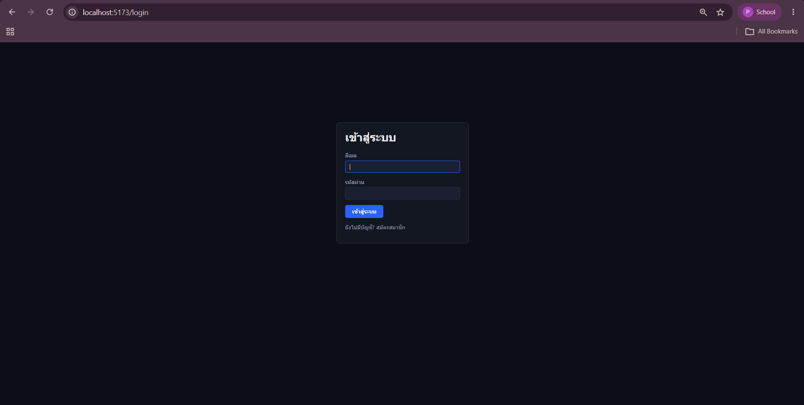<br><sub>หน้าเข้าสู่ระบบ</sub></td><td width="50%" valign="top">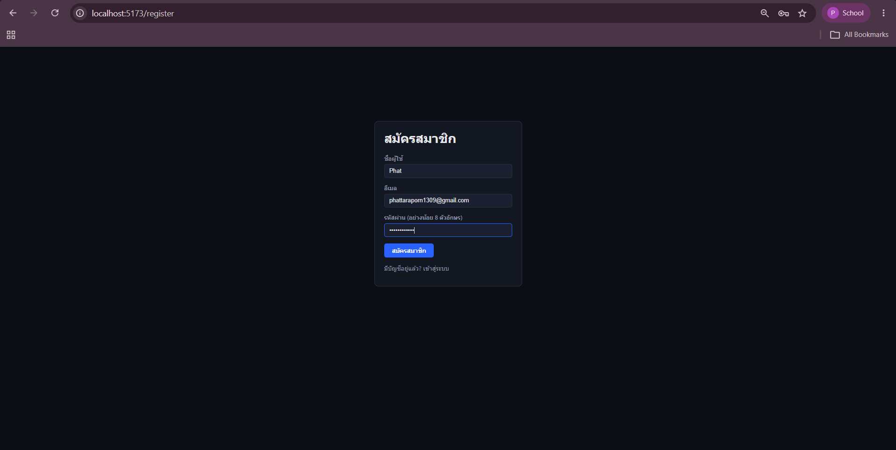<br><sub>หน้าสมัครสมาชิก</sub></td></tr>
<tr><td width="50%" valign="top">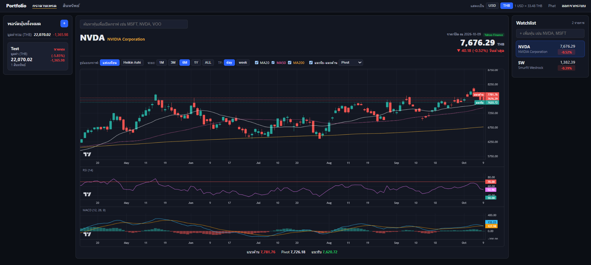<br><sub>หน้าหลัก 3 คอลัมน์: พอร์ต · กระดานเทรด (แท่งเทียน, MA, RSI, MACD) · Watchlist</sub></td><td width="50%" valign="top">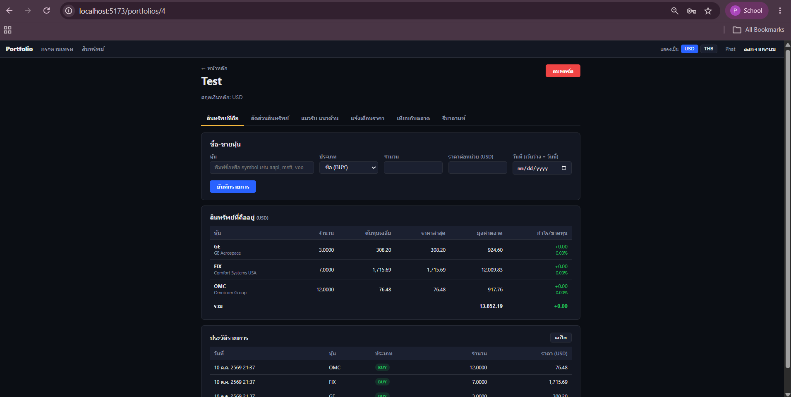<br><sub>สินทรัพย์ที่ถือ กำไร/ขาดทุน และฟอร์มซื้อ-ขาย</sub></td></tr>
<tr><td width="50%" valign="top">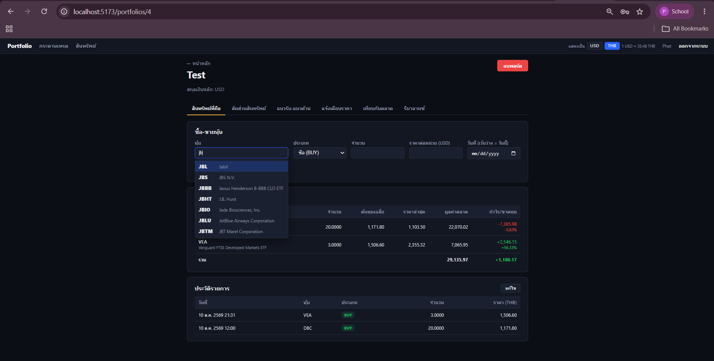<br><sub>ค้นหาหุ้น: ไม่พบในรายชื่อจะค้นต่อจาก Yahoo Finance</sub></td><td width="50%" valign="top">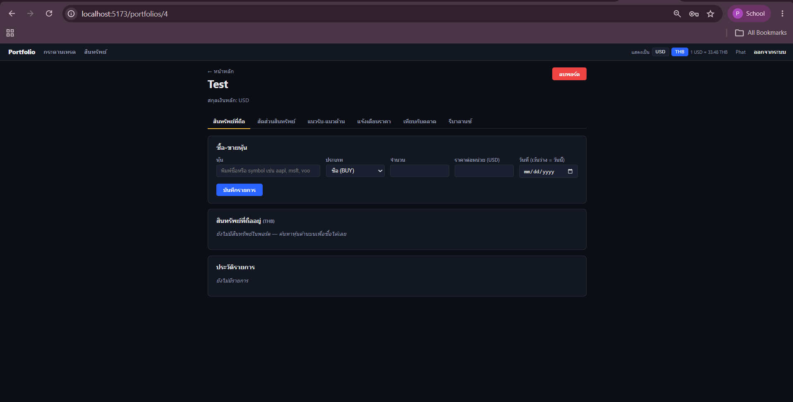<br><sub>แก้ไข/ลบรายการซื้อขายย้อนหลัง</sub></td></tr>
<tr><td width="50%" valign="top">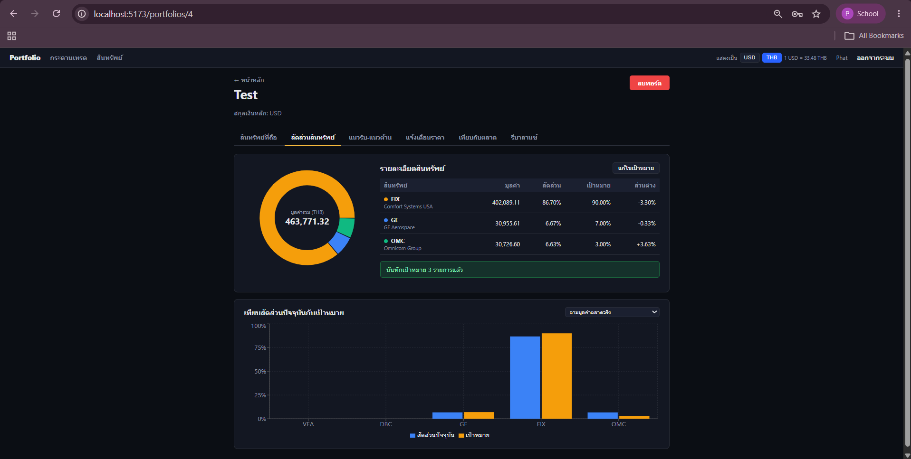<br><sub>Asset Allocation: สัดส่วนปัจจุบันเทียบเป้าหมาย</sub></td><td width="50%" valign="top">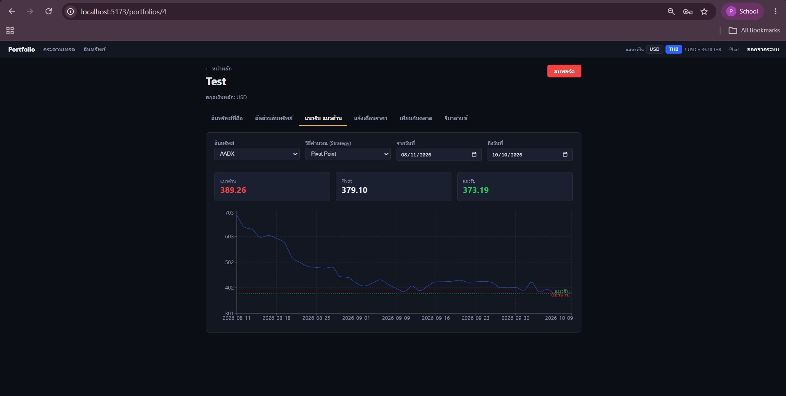<br><sub>แนวรับ-แนวต้านบนกราฟราคา</sub></td></tr>
<tr><td width="50%" valign="top">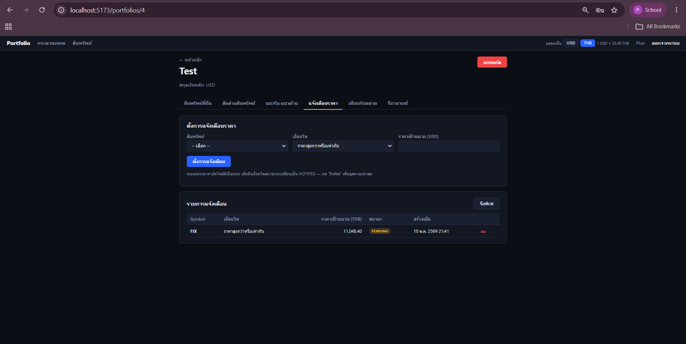<br><sub>แจ้งเตือนราคาและสถานะ</sub></td><td width="50%" valign="top">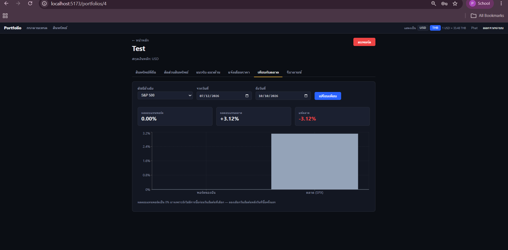<br><sub>เปรียบเทียบผลตอบแทนกับ S&amp;P 500 / Dow Jones</sub></td></tr>
<tr><td width="50%" valign="top">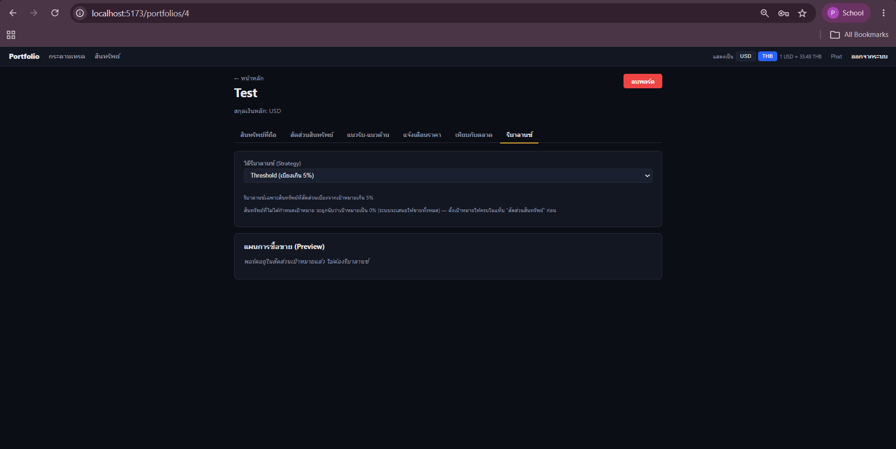<br><sub>แผนรีบาลานซ์ก่อนยืนยัน</sub></td><td width="50%" valign="top">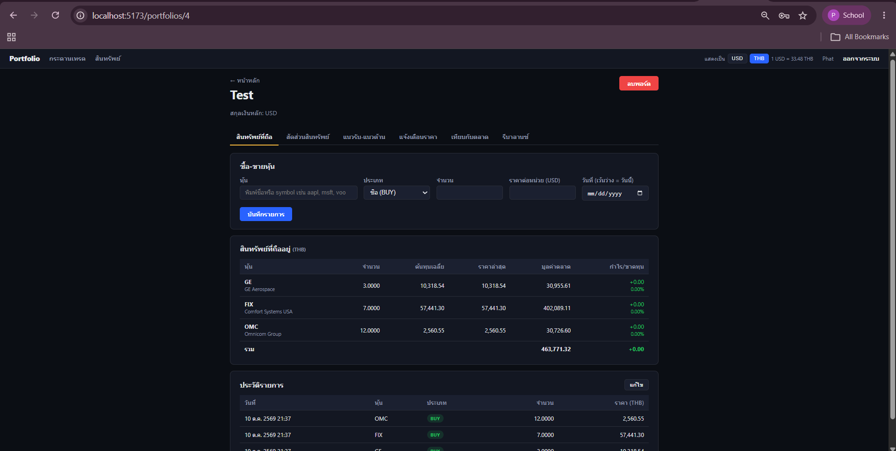<br><sub>สลับแสดงมูลค่าเป็นเงินบาท (USD/THB)</sub></td></tr>
</table>

<details>
<summary><b>หลักฐานด้านเทคนิค</b> (Swagger, Error Response, ผลเทสต์, CI/CD, Render)</summary>

<table>
<tr><td width="50%" valign="top">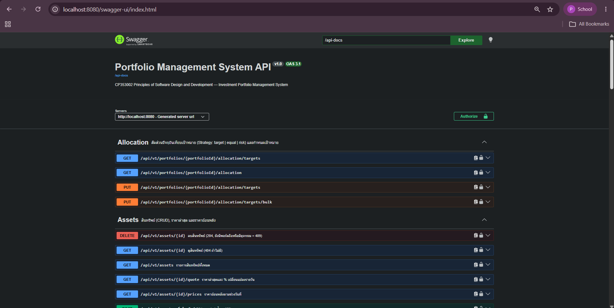<br><sub>Swagger UI บนเว็บที่ deploy</sub></td><td width="50%" valign="top">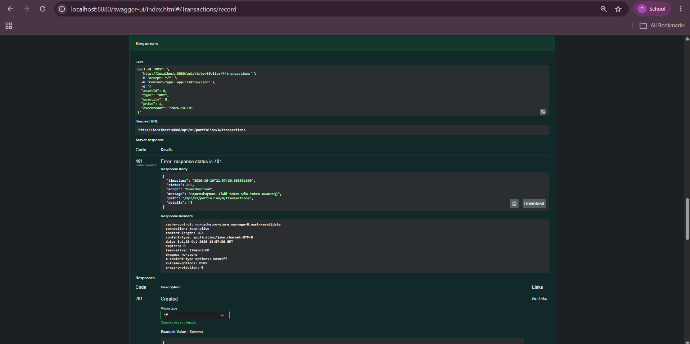<br><sub>Error Response เมื่อข้อมูลไม่ผ่าน validation</sub></td></tr>
<tr><td width="50%" valign="top">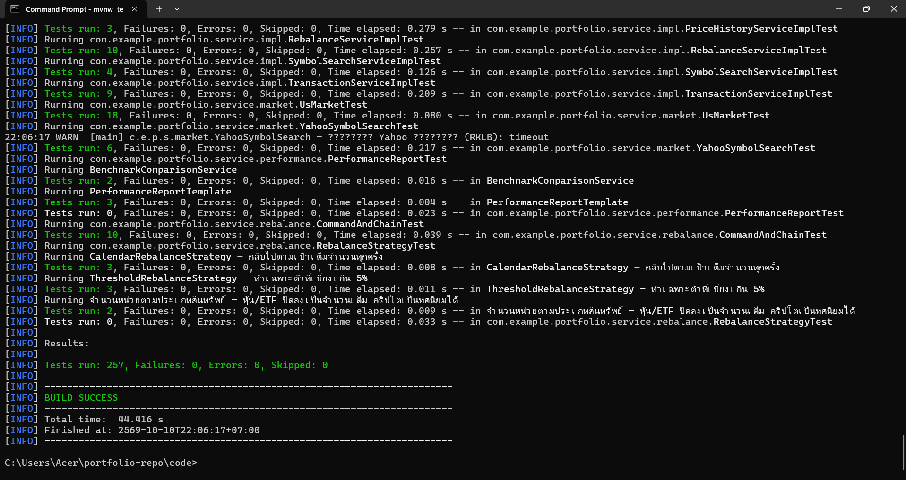<br><sub>ผลการรันเทสต์ 257 ตัว ผ่านทั้งหมด</sub></td><td width="50%" valign="top">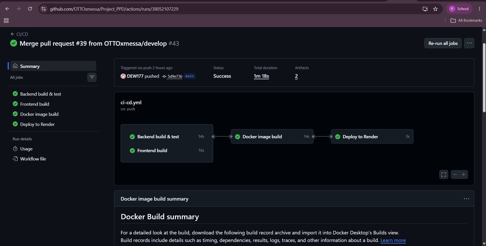<br><sub>GitHub Actions: backend · frontend · docker · deploy</sub></td></tr>
<tr><td width="50%" valign="top">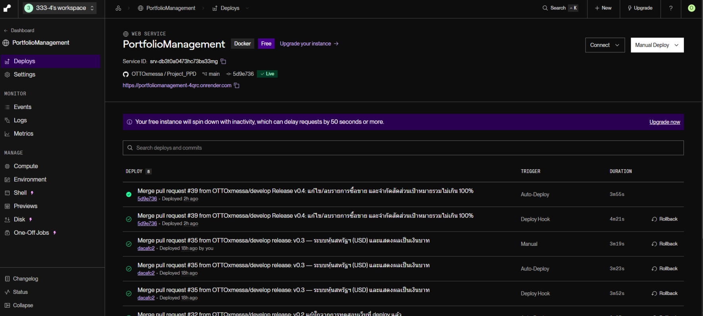<br><sub>สถานะการ deploy บน Render</sub></td><td></td></tr>
</table>

</details>

<details>
<summary><b>การทำงานเป็นทีม</b> (Branches, Pull Requests, Releases)</summary>

<table>
<tr><td width="50%" valign="top">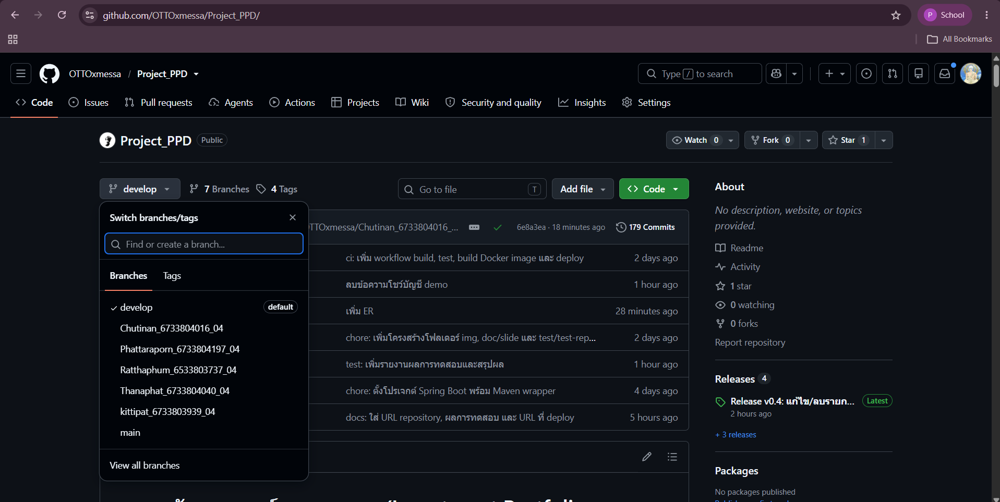<br><sub>Branch ของสมาชิกแต่ละคน + develop + main</sub></td><td width="50%" valign="top">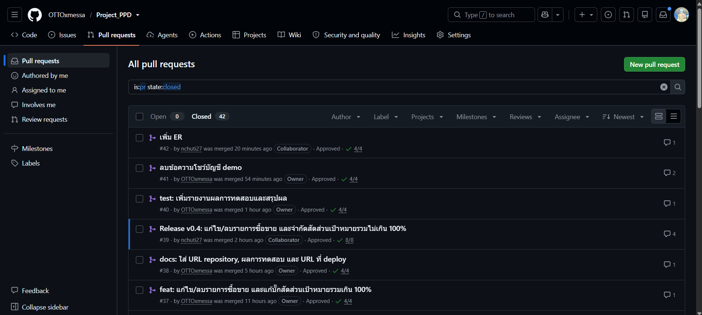<br><sub>Pull Request ที่ merge แล้ว</sub></td></tr>
<tr><td width="50%" valign="top">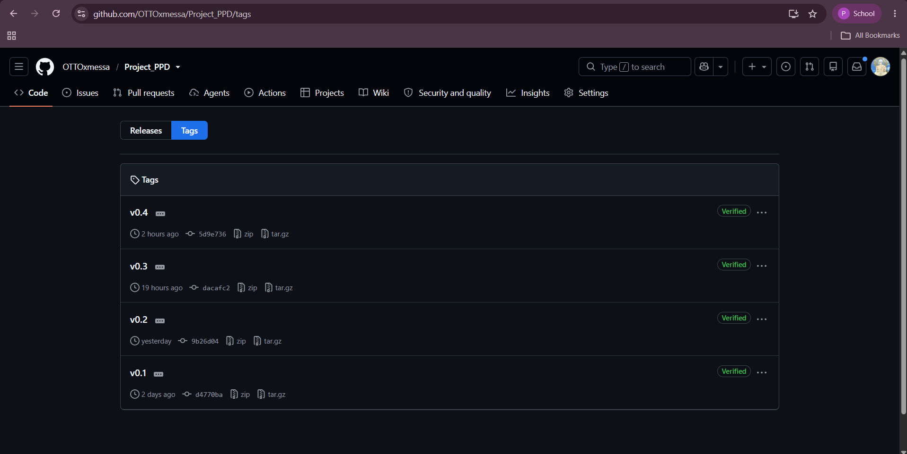<br><sub>Tag ของแต่ละเวอร์ชัน</sub></td><td></td></tr>
</table>

</details>

---

## ขอบเขตของระบบและแนวทางการพัฒนาต่อ

### ขอบเขตปัจจุบัน
- รองรับเฉพาะ**หุ้นและ ETF ในตลาดสหรัฐฯ** ราคาทุกตัวและมูลค่าพอร์ตเป็น **USD** พอร์ตทุกพอร์ตใช้สกุล USD
- ตรวจตั้งแต่ฝั่ง API ไม่ใช่แค่หน้าเว็บ (`service/market/UsMarket`): ตลาดอื่น, คริปโต หรือสกุลเงินอื่น ตอบ **400** พร้อมเหตุผล
- รายชื่อหุ้นสำหรับค้นหา (`symbols.txt`): สมาชิก **S&P 500** ทั้งหมด (ซึ่งรวม **Dow Jones 30** ทุกตัวแล้ว) และ ETF หลักของสหรัฐฯ 69 ตัว
- ถ้าคำค้นไม่ตรงกับรายชื่อข้างบน ระบบค้นต่อจาก **Yahoo Finance** (`YahooSymbolSearch`) จึงเจอหุ้นและ ETF **ทุกตัวที่จดทะเบียนใน NYSE, NASDAQ, NYSE American, NYSE Arca และ Cboe** (เช่น RKLB, EOSE) ไม่รวมหุ้นนอกตลาด (OTC/Pink Sheets)
- ดัชนีอ้างอิง: **S&P 500** (`SPX` → `^GSPC`) และ **Dow Jones Industrial Average** (`DJI` → `^DJI`)
- **แสดงผลเป็นเงินบาท (ดูอย่างเดียว):** ปุ่ม USD / THB บน navbar แปลงมูลค่าและราคาที่แสดงด้วยอัตราปิดล่าสุดของ `THB=X` จาก Yahoo (backend จำค่าไว้ 1 ชั่วโมง ตั้งได้ที่ `market-data.fx.cache-minutes`) ข้อมูลในฐานข้อมูล การคำนวณ และช่องกรอกราคายังเป็น USD ถ้าดึงอัตราไม่ได้จะแสดงเป็น USD พร้อมแจ้งเตือน

เหตุผลที่จำกัดตลาดเดียว: ระบบแปลงสกุลเงินแค่ตอนแสดงผล ยังไม่แปลงในการคำนวณ ถ้าพอร์ตเดียวมีทั้งหุ้นไทย (บาท) และหุ้นสหรัฐฯ (ดอลลาร์) มูลค่ารวม สัดส่วน แผนรีบาลานซ์ และการเทียบกับตลาดจะผิดทั้งหมด
และข้อมูลหุ้นสหรัฐฯ จาก Yahoo Finance ครบถ้วนกว่า (เช่น ดัชนี SET ดึงได้ไม่ครบ)

### แนวทางการพัฒนาต่อ
1. **รองรับตลาดอื่น เริ่มจากตลาดหลักทรัพย์แห่งประเทศไทย (SET)** แยกสกุลเงินต่อพอร์ต และเพิ่มดัชนี SET เป็น benchmark
2. **แปลงสกุลเงินจริง** เก็บอัตราแลกเปลี่ยนย้อนหลัง ให้พอร์ตเดียวถือหลายตลาดได้และคำนวณกำไรที่รวมผลจากค่าเงิน
3. **คริปโต** (BTC, ETH ฯลฯ) ซึ่งซื้อขายเป็นทศนิยมและเปิดตลอด 24 ชั่วโมง
4. **บัญชีเงินสดในพอร์ต** เพื่อเก็บเงินที่เหลือจากการขายหรือการรีบาลานซ์แบบ Threshold
5. **ซื้อเศษหุ้น (fractional shares)** ซึ่งโบรกเกอร์สหรัฐฯ บางเจ้ารองรับ ตอนนี้ระบบปัดหุ้นและ ETF ในแผนรีบาลานซ์เป็นจำนวนเต็ม

---

## Project Structure

```
Project_PPD/
├── code/                          # Source code + Configuration
│   ├── pom.xml
│   ├── docker-compose.yml         # PostgreSQL สำหรับพัฒนา
│   ├── Dockerfile
│   ├── src/main/java/com/example/portfolio/
│   │   ├── config/                # Security, Swagger, Scheduling, RestTemplate
│   │   ├── common/                # ของที่ใช้ร่วมกัน: NamedStrategy, StrategyRegistry
│   │   ├── controller/api/        # REST Controllers (Presentation Layer)
│   │   ├── controller/web/        # ส่ง index.html ของ React ตอน deploy
│   │   ├── service/               # Service interfaces (สัญญาที่ Controller/Scheduler เรียก)
│   │   │   ├── impl/              # Service implementations (Business Logic + Transaction)
│   │   │   ├── allocation/        # ฟีเจอร์ 1 — Strategy
│   │   │   ├── analysis/          # ฟีเจอร์ 2 — Strategy
│   │   │   ├── alert/             # ฟีเจอร์ 3 — Observer + State (+ condition/ = Strategy ของเงื่อนไขราคา)
│   │   │   ├── holding/           # Strategy ปรับ holding ตามประเภทธุรกรรม (ซื้อ/ขาย)
│   │   │   ├── performance/       # ฟีเจอร์ 4 — Template Method
│   │   │   ├── rebalance/         # ฟีเจอร์ 5 — Strategy + Command + Chain of Responsibility
│   │   │   └── market/            # ราคา, ค้นหาหุ้น, Yahoo Adapter
│   │   ├── repository/            # Spring Data JPA (Repository Layer)
│   │   ├── domain/entity/         # JPA Entities
│   │   ├── domain/enums/
│   │   ├── dto/request/, dto/response/
│   │   ├── mapper/                # Request -> Entity, Entity/ผลลัพธ์ -> Response DTO
│   │   ├── exception/             # GlobalExceptionHandler, ErrorResponse
│   │   ├── security/              # JWT
│   │   └── scheduler/             # งานตามเวลา — เรียก Service เท่านั้น
│   ├── src/main/resources/        # application*.yml, data.sql, schema.sql, symbols.txt
│   ├── src/test/                  # Unit & Integration tests
│   └── frontend/                  # React + Vite
│       └── src/
│           ├── pages/             # Dashboard, PortfolioDetail, Assets, Login, Register
│           ├── components/        # dashboard/, portfolio/, chart/, SymbolSearch
│           ├── api/, context/, utils/
├── test/                          # แผนการทดสอบ (README.md)
│   └── test-report/               # ผล Surefire จาก CI + สรุปผล
├── doc/                           # เอกสาร, diagrams, slide
│   ├── solid-analysis.md
│   ├── design-patterns.md
│   ├── data-dictionary.md
│   ├── diagrams/              # ER, Use Case, Domain Model, Sequence, Component, Deployment + diagram_des.md
│   └── slide/
├── img/                           # Screenshots 20 ภาพ (ใช้ในหัวข้อ Screenshots)
└── README.md
```
