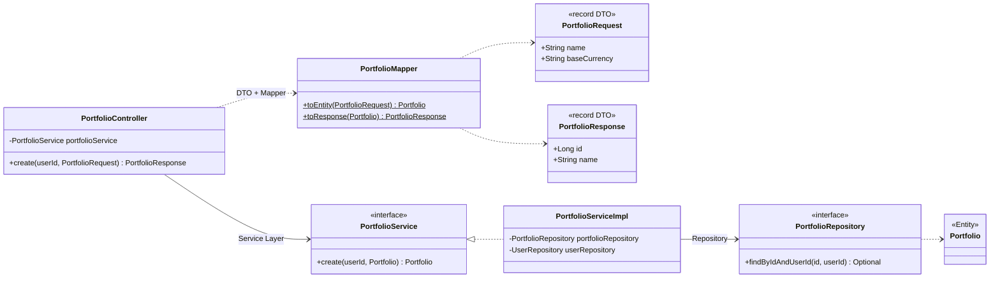
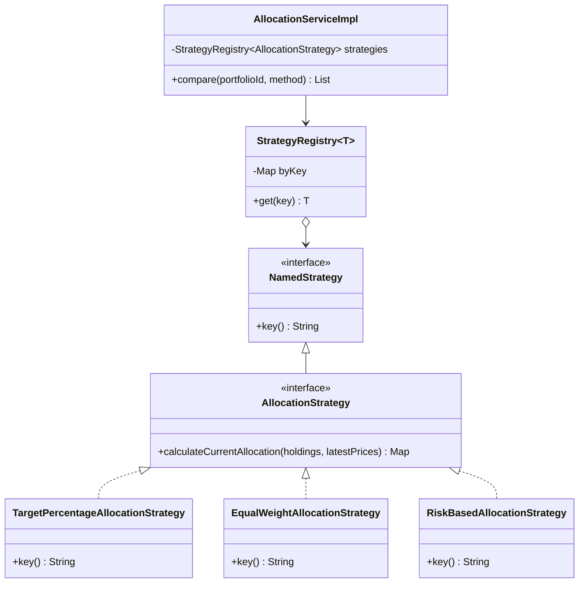
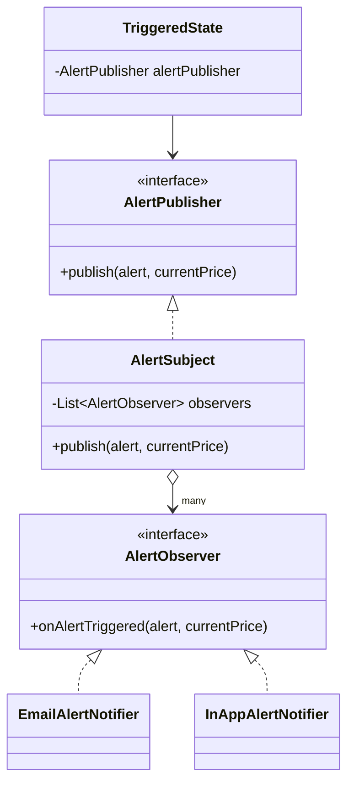
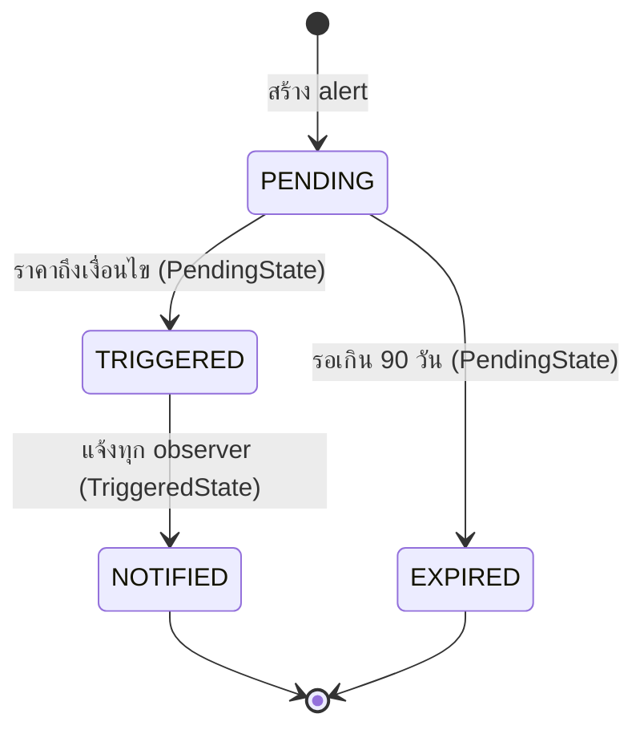
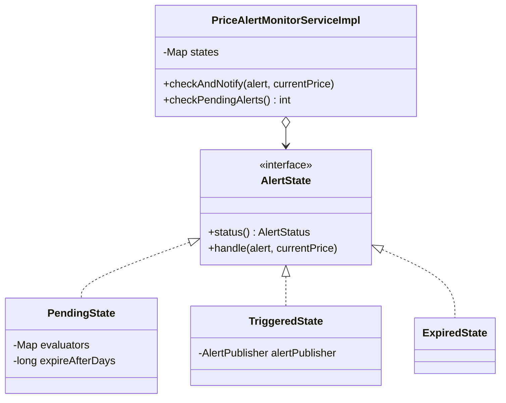
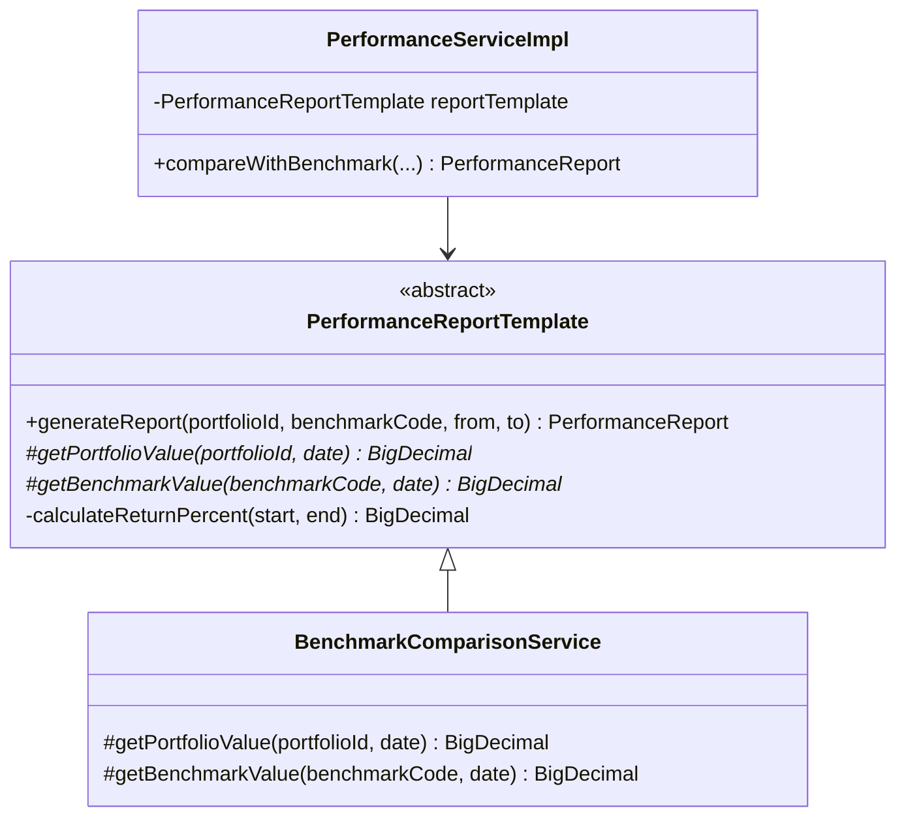
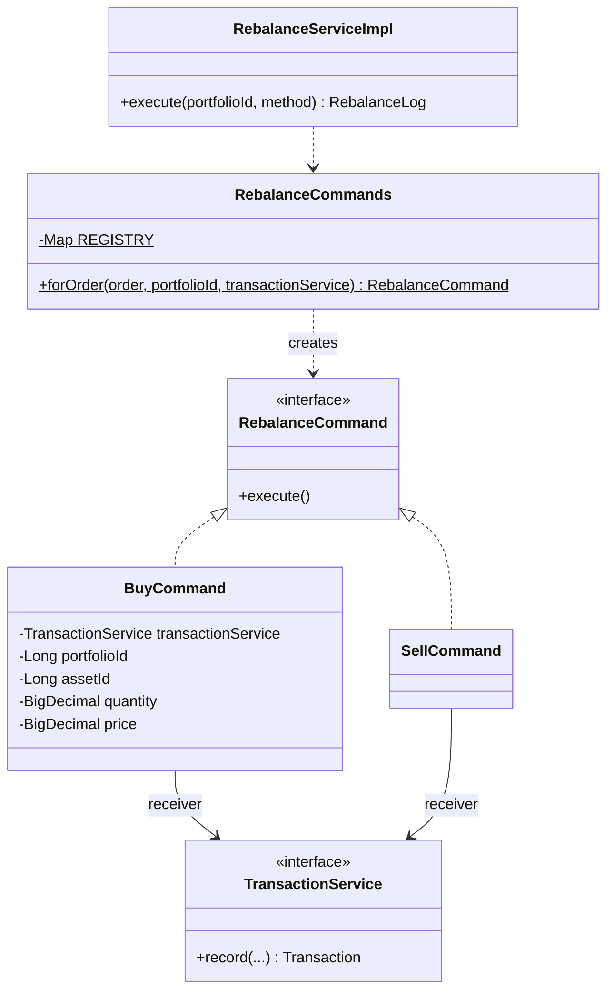
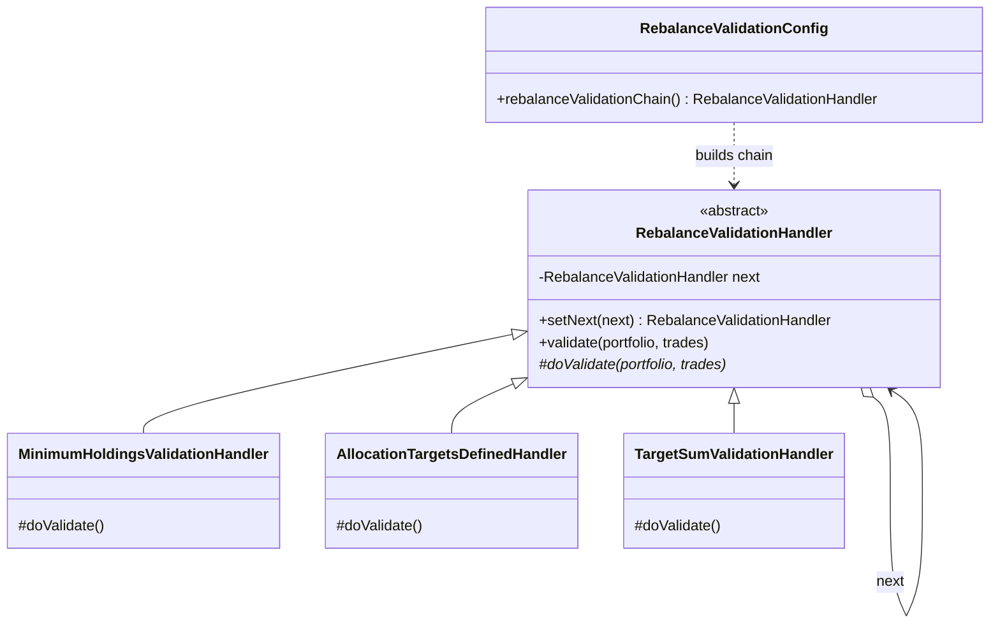
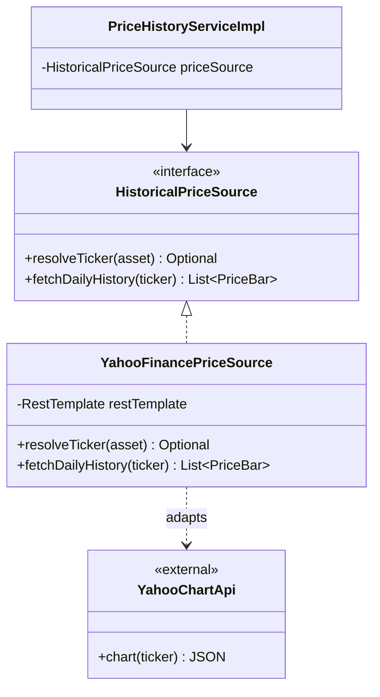

# Design Patterns — ระบบจัดการพอร์ตการลงทุน

เอกสารนี้อธิบาย Design Pattern ทุกตัวที่ใช้ในระบบ ตามใบงานข้อ 5: Pattern | ปัญหาที่แก้ | ไฟล์/คลาสที่ใช้ | Class Diagram

- **5.1 Enterprise / Architectural Patterns:** ใช้ครบทั้ง 6 แบบ
- **5.2 GoF Patterns:** เลือกกลุ่ม **Behavioral** ใช้ 6 แบบ (ขั้นต่ำ 3) คือ Strategy, Observer, State, Template Method, Command และ Chain of Responsibility
- **นอกกลุ่มที่เลือก:** ใช้ **Adapter** (Structural) อีก 1 แบบ เฉพาะจุดที่ต่อกับ Yahoo Finance เพราะเป็นปัญหาที่ Adapter แก้ได้ตรงที่สุด

ทุก pattern ด้านล่างแก้ปัญหาที่มีอยู่จริงในฟีเจอร์ของระบบ และมี unit test ยืนยันว่าทำงาน (ดูคอลัมน์ "ทดสอบที่")

## ตารางสรุป

### 5.1 Enterprise / Architectural Patterns

| Pattern | ปัญหาที่แก้ | ไฟล์/คลาสที่ใช้ | Class Diagram |
|---|---|---|---|
| Layered Architecture | โค้ดทุกเรื่องปนกันในที่เดียว แก้ส่วนหนึ่งแล้วกระทบส่วนอื่น | แพ็กเกจ `controller` → `service` → `repository` → `domain` (กฎตรวจโดย `LayeredArchitectureTest`) | [ดู](#d-enterprise) |
| MVC | แยกการรับคำขอ ข้อมูล และการแสดงผลออกจากกัน | Controller: `controller/api/*Controller`, Model: `domain/entity` + `dto`, View: React (`code/frontend`) | [ดู](#d-enterprise) |
| Repository | service ไม่ควรเขียน SQL หรือรู้จักรายละเอียดฐานข้อมูล | `repository/*Repository` (Spring Data JPA 11 ตัว) | [ดู](#d-enterprise) |
| Service Layer | กฎทางธุรกิจและ transaction ต้องอยู่จุดเดียว ไม่กระจายใน controller | `service/*Service` (interface 17 ตัว) + `service/impl/*ServiceImpl` | [ดู](#d-enterprise) |
| DTO + Mapper | ถ้าส่ง Entity ออก API ตรง ๆ แก้ฐานข้อมูลแล้ว API เปลี่ยนตาม และอาจหลุดข้อมูลภายใน เช่น `passwordHash` | `dto/request`, `dto/response`, `mapper/*Mapper` | [ดู](#d-enterprise) |
| Dependency Injection | คลาสที่ `new` dependency เองจะผูกกับคลาสตัวจริง ทดสอบแยกไม่ได้ | Constructor Injection ทั้งโปรเจกต์ (`@RequiredArgsConstructor` หรือ constructor เขียนเอง) ไม่มี `@Autowired` บน field | [ดู](#d-enterprise) |

### 5.2 GoF Patterns — กลุ่ม Behavioral

| Pattern | ปัญหาที่แก้ | ไฟล์/คลาสที่ใช้ | Class Diagram |
|---|---|---|---|
| Strategy | ฟีเจอร์เดียวมีหลายวิธีคำนวณให้ผู้ใช้เลือก ถ้าใช้ `if/switch` ต้องแก้โค้ดเดิมทุกครั้งที่เพิ่มวิธี | `AllocationStrategy` (3 แบบ), `SupportResistanceStrategy` (2), `RebalanceStrategy` (2), `AlertConditionEvaluator` (2), `HoldingUpdateRule` (2) + `common/StrategyRegistry` | [ดู](#d-strategy) |
| Observer | ราคาถึงเป้าแล้วต้องแจ้งหลายช่องทาง และจะเพิ่มช่องทางในอนาคต | `AlertPublisher` ← `AlertSubject` → `AlertObserver` ← `EmailAlertNotifier`, `InAppAlertNotifier` | [ดู](#d-observer) |
| State | alert แต่ละสถานะทำงานต่างกัน (รอตรวจ / ส่งแจ้งเตือน / หมดอายุ) ถ้าใช้ `if (status == …)` จะซ้อนกันยาว | `AlertState` ← `PendingState`, `TriggeredState`, `ExpiredState` + `PriceAlertMonitorServiceImpl` | [ดู](#d-state) |
| Template Method | รายงานผลตอบแทนต้องคำนวณตามลำดับเดิมเสมอ ต่างกันแค่แหล่งข้อมูลมูลค่า | `PerformanceReportTemplate` ← `BenchmarkComparisonService` | [ดู](#d-template) |
| Command | ตอนรีบาลานซ์ต้องเรียงคำสั่งซื้อขาย (ขายก่อนซื้อ) แล้วสั่งทำทีละคำสั่งผ่านรูปแบบเดียวกัน | `RebalanceCommand` ← `BuyCommand`, `SellCommand` + `RebalanceCommands` (สร้าง Command จากตาราง) | [ดู](#d-command) |
| Chain of Responsibility | ก่อนซื้อขายจริงมีเงื่อนไขที่ต้องผ่านหลายข้อตามลำดับ และจะมีเพิ่มอีก | `RebalanceValidationHandler` ← `MinimumHoldingsValidationHandler` → `AllocationTargetsDefinedHandler` → `TargetSumValidationHandler` (ประกอบที่ `RebalanceValidationConfig`) | [ดู](#d-chain) |

### นอกกลุ่มที่เลือก — Structural

| Pattern | ปัญหาที่แก้ | ไฟล์/คลาสที่ใช้ | Class Diagram |
|---|---|---|---|
| Adapter | Yahoo Finance ส่ง JSON รูปแบบของตัวเอง แต่ระบบต้องการ `PriceBar` และไม่อยากผูกกับผู้ให้บริการรายเดียว | `HistoricalPriceSource` ← `YahooFinancePriceSource`, `MarketDataProvider` ← `ExternalMarketDataAdapter` | [ดู](#d-adapter) |

---

## 1. Enterprise Patterns — ตัวอย่างการสร้างพอร์ตใหม่

`POST /api/v1/portfolios` ผ่านทุกชั้นตามลำดับ แต่ละคลาสทำหน้าที่เดียว และรู้จักชั้นถัดไปผ่าน interface เท่านั้น

| Pattern | เห็นในแผนภาพตรงไหน | เหตุผลที่เลือก |
|---|---|---|
| Layered | Controller → Service → Repository → Entity ไม่มีลูกศรย้อนกลับหรือข้ามชั้น | ใบงานบังคับ และทำให้เปลี่ยนแต่ละชั้นได้อิสระ เช่น เปลี่ยนฐานข้อมูลไม่กระทบ controller |
| MVC | `PortfolioController` (C), `Portfolio` + DTO (M), React (V) | backend เป็น REST จึงส่งข้อมูลให้ React แสดงผล ไม่ได้ render HTML เอง |
| Repository | `PortfolioRepository` | Spring Data สร้าง query จากชื่อเมธอด service ไม่ต้องเขียน SQL |
| Service Layer | `PortfolioService` / `PortfolioServiceImpl` | ตรวจสิทธิ์เจ้าของพอร์ตและจัดการ transaction ที่จุดเดียว |
| DTO + Mapper | `PortfolioRequest`, `PortfolioResponse`, `PortfolioMapper` | API ไม่เปลี่ยนตามโครงตาราง และไม่ส่งข้อมูลภายในออกไป |
| Dependency Injection | ทุกลูกศรคือ dependency ที่รับผ่าน constructor | test ใส่ mock แทนได้ทันที (ดู `PortfolioServiceImplTest`) |

---

## 2. Strategy

**ปัญหา:** ฟีเจอร์ 1, 2 และ 5 ให้ผู้ใช้เลือกวิธีคำนวณเอง (`?method=target|equal|risk`, `?method=pivot|ma`, `?method=threshold|calendar`) ถ้าเขียน `switch` ต้องแก้โค้ดเดิมทุกครั้งที่เพิ่มวิธีใหม่

**วิธีแก้:** แต่ละวิธีเป็นคลาสของตัวเองที่ implement interface เดียวกันและมีชื่อ (`key()`) Spring ฉีดทุกตัวมาเป็น `List` แล้ว `StrategyRegistry` หาตัวที่ตรงกับชื่อที่ผู้ใช้ส่งมา

ใช้รูปแบบเดียวกันอีก 4 ชุด:

| Strategy | Implementation | ใช้ที่ |
|---|---|---|
| [`SupportResistanceStrategy`](../code/src/main/java/com/example/portfolio/service/analysis/SupportResistanceStrategy.java) | `PivotPointCalculator` (pivot), `MovingAverageBandCalculator` (ma) | `SupportResistanceServiceImpl` |
| [`RebalanceStrategy`](../code/src/main/java/com/example/portfolio/service/rebalance/RebalanceStrategy.java) | `ThresholdRebalanceStrategy`, `CalendarRebalanceStrategy` | `RebalanceServiceImpl` |
| [`AlertConditionEvaluator`](../code/src/main/java/com/example/portfolio/service/alert/condition/AlertConditionEvaluator.java) | `PriceAboveEvaluator`, `PriceBelowEvaluator` | `PendingState` |
| [`HoldingUpdateRule`](../code/src/main/java/com/example/portfolio/service/holding/HoldingUpdateRule.java) | `BuyHoldingRule`, `SellHoldingRule` | `HoldingServiceImpl` |

**ทดสอบที่:** `AllocationStrategyTest`, `SupportResistanceTest`, `RebalanceStrategyTest`, `StrategyRegistryTest`, `AlertStateTest`, `HoldingServiceImplTest`

---

## 3. Observer

**ปัญหา:** เมื่อราคาถึงเป้า ต้องแจ้งผู้ใช้หลายช่องทาง (อีเมล, ในแอป) และอยากเพิ่มช่องทางใหม่ เช่น LINE ได้โดยไม่แก้ตรรกะการตรวจราคา

**วิธีแก้:** `AlertSubject` ถือรายชื่อ `AlertObserver` ทุกตัวที่ Spring พบ แล้วแจ้งทุกตัวเมื่อมีเหตุการณ์ ผู้ส่ง (`TriggeredState`) รู้จักแค่ `AlertPublisher`

**เพิ่มช่องทางใหม่:** สร้างคลาส `@Component` ที่ implement `AlertObserver` หนึ่งคลาส ไม่ต้องแก้ไฟล์อื่น

**ทดสอบที่:** `PriceAlertMonitorServiceImplTest` (`subjectNotifiesEveryObserver`, `triggersAndNotifiesAllObservers`)

---

## 4. State

**ปัญหา:** price alert แต่ละสถานะต้องทำงานต่างกัน ถ้าเขียน `if (status == PENDING) … else if (status == TRIGGERED) …` ใน service จะยาวขึ้นทุกครั้งที่มีสถานะใหม่

**วิธีแก้:** แต่ละสถานะเป็นคลาสที่รู้ว่าต้องทำอะไรและจะไปสถานะไหนต่อ `PriceAlertMonitorServiceImpl` เลือก state จากตาราง `status → AlertState` แล้วให้ state จัดการ วนต่อจนสถานะไม่เปลี่ยน

ระยะเวลาก่อนหมดอายุตั้งได้ที่ `alert.expire-after-days` (ค่าเริ่มต้น 90 วัน) — alert ที่หมดอายุจะไม่ถูก scheduler ดึงมาตรวจอีก

**ทดสอบที่:** `AlertStateTest`, `PriceAlertMonitorServiceImplTest` (`staleAlertExpires`)

---

## 5. Template Method

**ปัญหา:** รายงานเปรียบเทียบผลตอบแทน (ฟีเจอร์ 4) ต้องคำนวณตามลำดับเดิมเสมอ คือ มูลค่าต้นงวด → ปลายงวด → % ผลตอบแทน → ส่วนต่างกับตลาด สิ่งที่อาจเปลี่ยนมีแค่ "ดึงมูลค่ามาจากไหน" ถ้าให้แต่ละรายงานเขียนสูตรเอง สูตรจะเพี้ยนไปคนละแบบ

**วิธีแก้:** `generateReport()` เป็น `final` กำหนดลำดับขั้นตอนและสูตรไว้ subclass เติมได้แค่ 2 hook

ตอนนี้มี subclass จริงตัวเดียว คือคำนวณมูลค่าจากธุรกรรมและราคาปิด ส่วนใน test มี subclass ที่ใส่มูลค่าตายตัว เพื่อทดสอบสูตรใน template แยกจากฐานข้อมูล ถ้าวันหน้าต้องการรายงานแบบอื่น (เช่น คิดเงินปันผลด้วย) ก็เพิ่ม subclass ได้โดยไม่แตะสูตร

**ทดสอบที่:** `PerformanceReportTest`, `PerformanceServiceImplTest`

---

## 6. Command

**ปัญหา:** แผนรีบาลานซ์ (ฟีเจอร์ 5) เป็นรายการคำสั่งซื้อและขายปนกัน ต้องเรียงให้ "ขายก่อนซื้อ" แล้วสั่งทำทีละคำสั่ง ผู้สั่งไม่ควรต้องรู้ว่าคำสั่งแต่ละแบบทำงานอย่างไร

**วิธีแก้:** ห่อแต่ละคำสั่งเป็น object ที่มี `execute()` เหมือนกัน `RebalanceCommands` สร้าง Command จากตาราง "ประเภท → คลาส" แล้ว `RebalanceServiceImpl` วนเรียก `execute()` ตามลำดับ

Command ทุกตัวบันทึกผ่าน `TransactionService` ซึ่งเป็นตัวรับคำสั่ง (receiver) จึงได้ทั้งประวัติธุรกรรมและ holding ที่อัปเดตแล้ว เหมือนผู้ใช้กดซื้อขายเอง

**ทดสอบที่:** `CommandAndChainTest`, `RebalanceServiceImplTest` (`executeSellsBeforeBuying`)

---

## 7. Chain of Responsibility

**ปัญหา:** ก่อนซื้อขายจริงตอนรีบาลานซ์ ต้องตรวจหลายเงื่อนไขตามลำดับ ถ้าข้อไหนไม่ผ่านต้องหยุดทันที เงื่อนไขพวกนี้ป้องกันความเสียหายจริง เช่น พอร์ตที่ยังไม่ตั้งเป้าหมาย ถ้ารีบาลานซ์แบบ calendar จะถูกมองว่าเป้าทุกตัวเป็น 0% และแผนจะสั่ง**ขายทั้งพอร์ต**

**วิธีแก้:** แต่ละเงื่อนไขเป็น handler หนึ่งห่วง ถ้าผ่านก็ส่งต่อห่วงถัดไป ลำดับประกอบไว้ที่ `RebalanceValidationConfig` จุดเดียว

| ลำดับ | Handler | ไม่ผ่านเมื่อ |
|---|---|---|
| 1 | `MinimumHoldingsValidationHandler` | พอร์ตยังไม่มีสินทรัพย์เลย |
| 2 | `AllocationTargetsDefinedHandler` | ยังไม่ได้ตั้งสัดส่วนเป้าหมาย |
| 3 | `TargetSumValidationHandler` | เป้าหมายรวมกันไม่เท่ากับ 100% (คลาดได้ 0.01% จากการปัดเศษ) |

ข้อไหนไม่ผ่านจะ throw `IllegalStateException` และ API ตอบ 409 พร้อมข้อความบอกสาเหตุ โดยยังไม่มีการซื้อขายใด ๆ เกิดขึ้น

**ทดสอบที่:** `CommandAndChainTest`, `RebalanceServiceImplTest` (`executeRejectedWithoutTargets`, `executeRejectedWhenTargetsDoNotSumTo100`)

---

## 8. Adapter (นอกกลุ่ม Behavioral)

**ปัญหา:** Yahoo Finance ไม่มี API ทางการ ส่ง JSON โครงของตัวเอง (`chart.result[0].indicators.quote[0].close[]`) และอาจถูกจำกัดการใช้งานเมื่อไหร่ก็ได้ ถ้า service อ่าน JSON นี้ตรง ๆ จะผูกกับ Yahoo และเปลี่ยนผู้ให้บริการไม่ได้

**วิธีแก้:** ระบบกำหนด interface ที่ตัวเองต้องการ (`HistoricalPriceSource` คืน `PriceBar`) แล้วให้ Adapter แปลงข้อมูลจาก Yahoo เข้ารูปนั้น

`ExternalMarketDataAdapter` ใช้หลักเดียวกันกับ `MarketDataProvider` (รูปแบบ API ของ Alpha Vantage) ไว้เป็นทางเลือก ตอนนี้ระบบใช้ `PriceHistoryMarketDataProvider` ที่อ่านราคาจากฐานข้อมูลเป็นหลัก (`@Primary`)

---

## Pattern ที่ไม่ได้ใช้ และเหตุผล

ใบงานกำหนดว่าห้ามใส่ pattern เพื่อให้ครบจำนวน จึงไม่ใช้ pattern ต่อไปนี้ เพราะไม่มีปัญหาในระบบที่ pattern นั้นแก้

| Pattern | เหตุผลที่ไม่ใช้ |
|---|---|
| Singleton (เขียนเอง) | Spring จัดการ bean เป็น singleton ให้อยู่แล้ว |
| Builder (เขียนเอง) | Entity ใช้ `@Builder` ของ Lombok ไม่ได้ออกแบบเพิ่ม จึงไม่นับเป็น pattern ของกลุ่ม |
| Facade / Decorator / Proxy | ไม่มีระบบย่อยที่ซับซ้อนพอให้ต้องรวมหน้าเดียว และไม่มีพฤติกรรมที่ต้องซ้อนเพิ่มทีละชั้น (Spring ใช้ Proxy ภายในสำหรับ `@Transactional` แต่ไม่ใช่สิ่งที่ทีมออกแบบ) |
| Factory Method / Abstract Factory | การสร้าง Command ใช้ตารางจับคู่อย่างง่ายใน `RebalanceCommands` ก็พอ ไม่มีตระกูลของ object ที่ต้องสร้างเป็นชุด |
