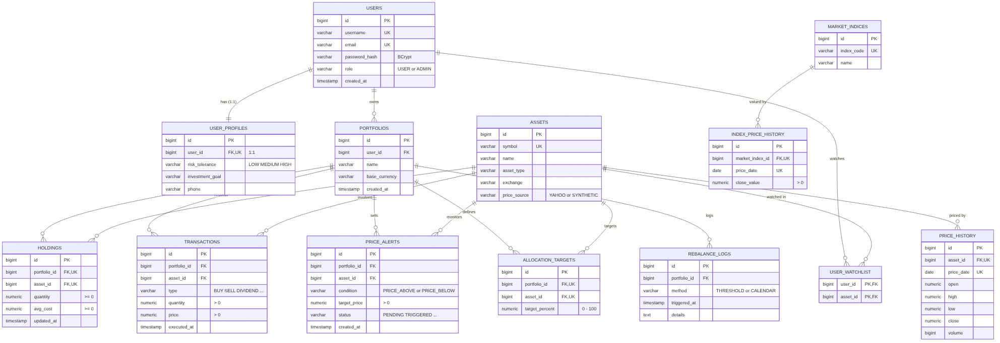
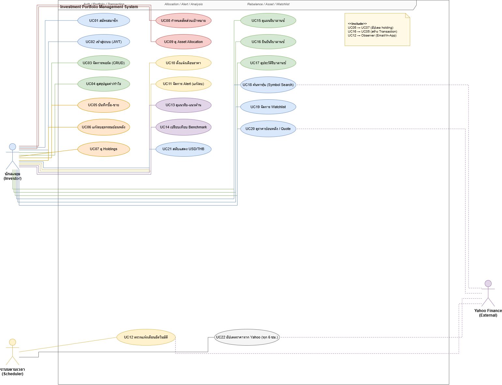
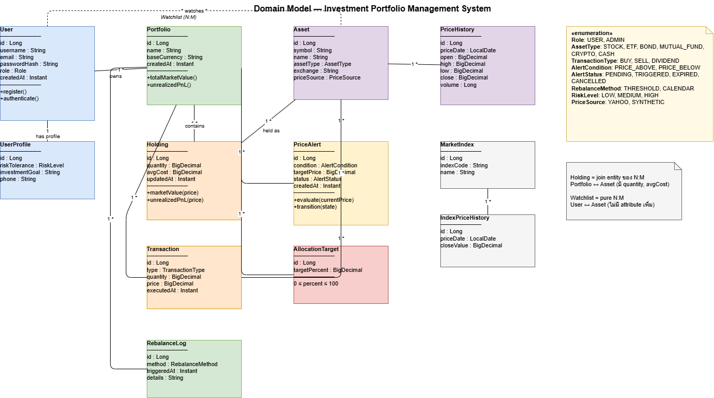
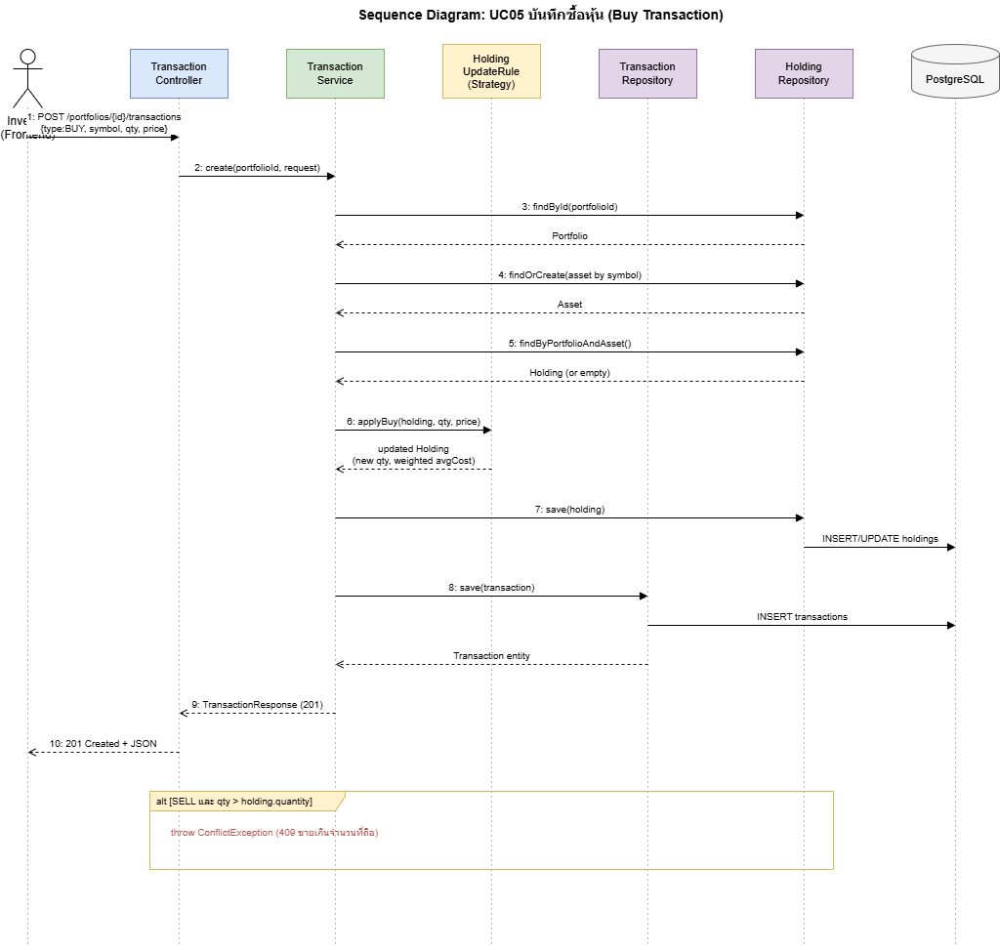
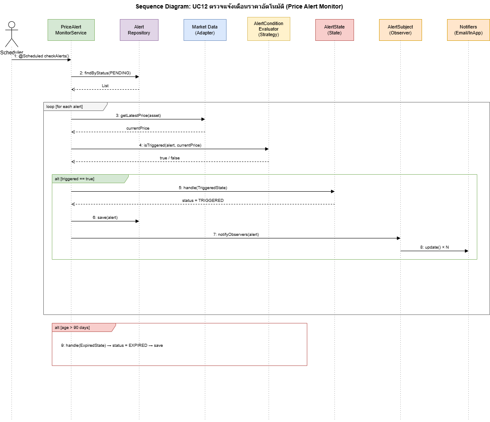
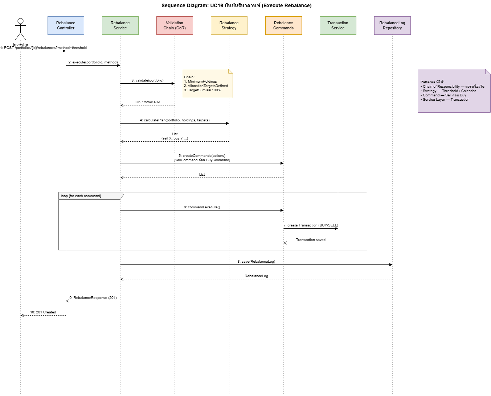
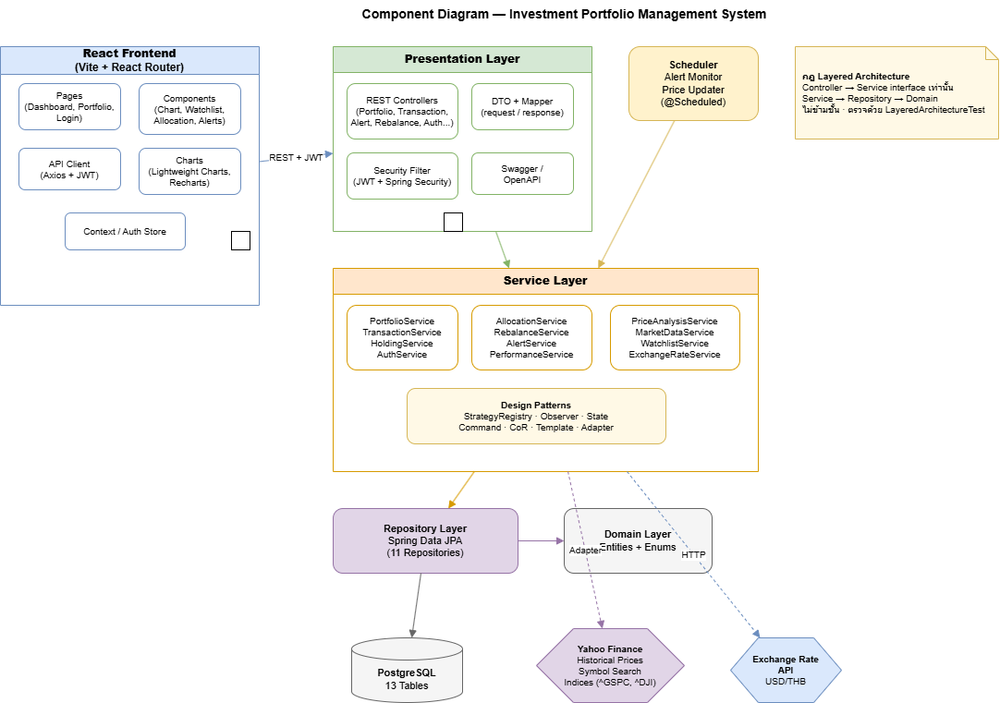
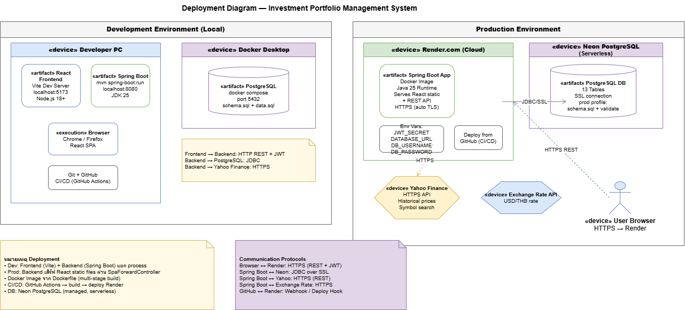

# ไดอะแกรมระบบ (System Diagrams)

เอกสารนี้อธิบายไดอะแกรมของระบบจัดการพอร์ตการลงทุน (Investment Portfolio Management System)  
ใช้ประกอบรายงานรายวิชา CP353002 Principles of Software Design and Development

## รายการไดอะแกรม

|  | ไดอะแกรม | ภาพ |
| -- | ------------------------ | --- |
| 1 | ER Diagram | [er-diagram.png](er-diagram.png) |
| 2 | Use Case Diagram | [01-use-case_.drawio.png](01-use-case_.drawio.png) |
| 3 | Domain Model | [02-domain-model__.png](02-domain-model__.png) |
| 4 | Sequence (ซื้อหุ้น) | [03-sequence-buy.drawio.png](03-sequence-buy.drawio.png) |
| 5 | Sequence (ตรวจ Alert) | [04-sequence-alert.drawio.png](04-sequence-alert.drawio.png) |
| 6 | Sequence (รีบาลานซ์) | [05-sequence-rebalance.drawio.png](05-sequence-rebalance.drawio.png) |
| 7 | Component Diagram | [07-component.drawio.png](07-component.drawio.png) |
| 8 | Deployment Diagram | [08-deployment.drawio.png](08-deployment.drawio.png) |

---

## 1. ER Diagram

แสดงโครงสร้างฐานข้อมูล PostgreSQL ของระบบ มี **13 ตาราง** (12 entity + ตารางเชื่อม `user_watchlist`)

### สรุปโครงสร้าง

| รายการ | ค่า |
| ------------------- | ------------------------------------------------------------------- |
| จำนวนตาราง | **13** (12 entity + `user_watchlist`) |
| Primary Key (PK) | ทุกตารางมี (ยกเว้น `user_watchlist` ใช้ composite PK จาก 2 FK) |
| Foreign Key (FK) | 15 ตัว |
| UNIQUE constraint | 9 ตัว |
| CHECK constraint | 19 ตัว (ค่า enum, จำนวน/ราคา > 0, เป้าหมาย 0–100%) |
| Index | 10 ตัว สำหรับ FK และ query ที่ใช้บ่อย |

### ความสัมพันธ์

| แบบ | ตาราง | กลไกในฐานข้อมูล | ฝั่ง JPA |
| ---------------------- | --------------------------------------------------------------------- | ------------------------------------------------------------ | --------------------------------- |
| **1:1** | `users` — `user_profiles` | `user_profiles.user_id` เป็น FK + UNIQUE | `@OneToOne` |
| **1:N** | `users` → `portfolios` | `portfolios.user_id` เป็น FK | `@ManyToOne` / `@OneToMany` |
| **1:N** | `portfolios` → `holdings`, `transactions`, `price_alerts`, `allocation_targets`, `rebalance_logs` | ตารางลูกมี FK `portfolio_id` | `@ManyToOne` / `@OneToMany` |
| **1:N** | `assets` → `price_history` | FK + UNIQUE (`asset_id`, `price_date`) | `@ManyToOne` |
| **1:N** | `market_indices` → `index_price_history` | FK + UNIQUE (`market_index_id`, `price_date`) | `@ManyToOne` |
| **N:M** (มีข้อมูลเพิ่ม) | `portfolios` ↔ `assets` ผ่าน `holdings` | `holdings` เก็บ `quantity`, `avg_cost` + UNIQUE คู่ FK | 2 × `@ManyToOne` (join entity) |
| **N:M** (ล้วน) | `users` ↔ `assets` ผ่าน `user_watchlist` | ตารางเชื่อมมีแค่ 2 FK รวมกันเป็น PK | `@ManyToMany` + `@JoinTable` |

### ตารางทั้งหมด

| # | ตาราง | เก็บอะไร | ความสัมพันธ์หลัก |
| -- | ---------------------- | --------------------------------------------- | ----------------------------------------- |
| 1 | `users` | บัญชีผู้ใช้ (JWT, BCrypt) | แม่ของ profiles, portfolios, watchlist |
| 2 | `user_profiles` | ข้อมูลเสริม (risk, เป้าหมาย, เบอร์โทร) | 1:1 กับ `users` |
| 3 | `portfolios` | พอร์ตการลงทุน (ชื่อ, สกุลเงิน USD) | N:1 `users` · แม่ของข้อมูลในพอร์ต |
| 4 | `assets` | สินทรัพย์ master (symbol, type, exchange) | ถูกอ้างจากหลายตาราง |
| 5 | `holdings` | จำนวนหุ้น + ต้นทุนเฉลี่ยในพอร์ต | join entity N:M portfolios ↔ assets |
| 6 | `transactions` | ประวัติ BUY / SELL / DIVIDEND | N:1 portfolios, assets |
| 7 | `price_history` | OHLCV รายวันของสินทรัพย์ | N:1 assets |
| 8 | `market_indices` | ดัชนีตลาด (SPX, DJI) | แม่ของ `index_price_history` |
| 9 | `index_price_history` | ค่าดัชนีรายวัน | N:1 market_indices |
| 10 | `price_alerts` | แจ้งเตือนราคา (condition, target, status) | N:1 portfolios, assets |
| 11 | `allocation_targets` | สัดส่วนเป้าหมาย 0–100% | N:1 portfolios, assets |
| 12 | `rebalance_logs` | ประวัติการรีบาลานซ์ | N:1 portfolios |
| 13 | `user_watchlist` | หุ้นที่ผู้ใช้ติดตาม | pure N:M users ↔ assets |

### นโยบาย ON DELETE

| พฤติกรรม | ใช้กับ | เหตุผล |
| ------------ | ---------------------------------------------------------------------- | --------------------------------------------------- |
| **CASCADE** | ลบ user → ลบ profile, portfolio, watchlist · ลบ portfolio → ลบ holding, transaction, alert, target, rebalance_log | ข้อมูลลูกเป็นของแม่โดยตรง ลบแม่แล้วไม่ควรค้าง |
| **RESTRICT** | ห้ามลบ `assets` ที่ยังถูกอ้างจาก holding หรือ transaction | ป้องกันประวัติการลงทุนหาย |

### Fetch และ Cascade ฝั่ง JPA

| การตั้งค่า | ค่าที่ใช้ |
| ---------------------------------- | -------------------------------------------------------------- |
| `@ManyToOne` ทุกตัว | `FetchType.LAZY` (กัน N+1) |
| `@OneToMany` / `@OneToOne` ฝั่งแม่ | `cascade = ALL, orphanRemoval = true` |
| `@ManyToMany` watchlist | ไม่ cascade (ลบ user ไม่ควรลบ asset) |

---

## 2. Use Case Diagram

แสดงขอบเขตระบบและปฏิสัมพันธ์ระหว่าง actor กับ use case ทั้งหมด

### Actor

| Actor | ประเภท | บทบาท |
| ------------------------ | --------- | --------------------------------------------------------------------- |
| นักลงทุน (Investor) | Primary | สมัครสมาชิก, จัดการพอร์ต, ซื้อ-ขาย, ตั้ง alert, รีบาลานซ์, ดูรายงาน |
| ระบบตามเวลา (Scheduler) | Secondary | ตรวจแจ้งเตือนอัตโนมัติ และอัปเดตราคาตามช่วงเวลา |
| Yahoo Finance | External | แหล่งราคาย้อนหลัง, ค้นหา symbol, ดัชนีตลาด |

### กลุ่ม Use Case

| กลุ่ม | Use Case |
| ------------------------------ | --------------- |
| Auth / Portfolio / Transaction | UC01–UC07 |
| Allocation / Alert / Analysis | UC08–UC14, UC21 |
| Rebalance / Asset / Watchlist | UC15–UC20 |
| Scheduler | UC12, UC22 |

### ความสัมพันธ์พิเศษ

- UC05 บันทึกซื้อ-ขายแล้วอัปเดต holding (UC07)
- UC16 รีบาลานซ์สร้าง Transaction จริง (UC05)
- UC12 ใช้ Observer แจ้ง Email / In-App เมื่อราคาถึงเป้า

---

## 3. Domain Model

แสดง entity ฝั่งโดเมน คุณสมบัติหลัก และความสัมพันธ์ สอดคล้องกับ ER 13 ตาราง

### Entity หลัก

| Entity | บทบาทในโดเมน | ความสัมพันธ์หลัก |
| ------------------ | --------------------------------------------------------- | ----------------------------------------- |
| `User` | บัญชีผู้ใช้ (JWT, BCrypt) | 1:1 UserProfile, 1:N Portfolio, N:M Asset |
| `UserProfile` | ข้อมูลเสริม (risk tolerance, เป้าหมาย) | 1:1 กับ User |
| `Portfolio` | พอร์ตการลงทุน (base currency = USD) | แม่ของ Holding, Transaction, Alert ฯลฯ |
| `Asset` | สินทรัพย์ master (STOCK / ETF) | ถูกอ้างจาก Holding, Transaction, Alert |
| `Holding` | จำนวนหุ้น + ต้นทุนเฉลี่ย | N:1 Portfolio, N:1 Asset |
| `Transaction` | ประวัติ BUY / SELL / DIVIDEND | N:1 Portfolio, N:1 Asset |
| `PriceAlert` | แจ้งเตือนราคา (condition + status) | N:1 Portfolio, N:1 Asset |
| `AllocationTarget` | สัดส่วนเป้าหมาย 0–100% | N:1 Portfolio, N:1 Asset |
| `RebalanceLog` | ประวัติการรีบาลานซ์ | N:1 Portfolio |
| `PriceHistory` | OHLCV รายวัน | N:1 Asset |
| `MarketIndex` | ดัชนี (SPX, DJI) | 1:N IndexPriceHistory |
| `IndexPriceHistory` | ค่าดัชนีรายวัน | N:1 MarketIndex |

### Enum ที่ใช้ในโดเมน

`Role`, `AssetType`, `TransactionType`, `AlertCondition`, `AlertStatus`, `RebalanceMethod`, `RiskLevel`, `PriceSource`

`Holding` เป็น join entity ของ N:M Portfolio ↔ Asset ที่มี `quantity` และ `avgCost`  
Watchlist เป็น pure N:M (User ↔ Asset) ไม่มี attribute เพิ่ม

---

## 4. Sequence Diagrams

แสดงลำดับการเรียกระหว่างชั้นเมื่อทำงานสำคัญ 3 กรณี

### 4.1 บันทึกซื้อหุ้น (UC05)

| ขั้น | ผู้ส่ง → ผู้รับ | การกระทำ |
| :--: | ---------------------------- | ----------------------------------------------------- |
| 1 | Investor → Controller | `POST /portfolios/{id}/transactions` |
| 2 | Controller → Service | `create(portfolioId, request)` |
| 3–5 | Service → Repository → DB | โหลด Portfolio, Asset, Holding |
| 6 | Service → HoldingUpdateRule | `applyBuy()` คำนวณ quantity + weighted avgCost (Strategy) |
| 7–8 | Service → Repository → DB | บันทึก Holding และ Transaction |
| 9–10 | Service → Controller → User | คืน `201 Created` |

กรณีขายเกินจำนวนที่ถือ: Service โยน `ConflictException` → HTTP 409

### 4.2 ตรวจแจ้งเตือนอัตโนมัติ (UC12)

| ขั้น | ผู้ส่ง → ผู้รับ | การกระทำ / Pattern |
| :--: | ---------------------------------- | ------------------------------------------- |
| 1 | Scheduler → MonitorService | `checkAlerts()` ตามเวลา |
| 2 | Monitor → Repository | ดึง alert สถานะ `PENDING` |
| 3–4 | Monitor → MarketData → Evaluator | ดึงราคา แล้วประเมินเงื่อนไข (Strategy) |
| 5 | Monitor → AlertState | เปลี่ยนสถานะเป็น `TRIGGERED` (State) |
| 6–8 | Monitor → Subject → Notifiers | แจ้ง Email / In-App (Observer) |
| 9 | (ทางเลือก) age > 90 วัน | เปลี่ยนเป็น `EXPIRED` |

Pattern ที่ใช้: **Strategy**, **State**, **Observer**

### 4.3 ยืนยันรีบาลานซ์ (UC16)

| ขั้น | ผู้ส่ง → ผู้รับ | การกระทำ / Pattern |
| :--: | ------------------------------- | ------------------------------------------------------- |
| 1 | Investor → Controller | `POST /portfolios/{id}/rebalances?method=` |
| 2–3 | Service → Validation Chain | ตรวจ 3 ห่วง (CoR): holdings, targets, sum = 100% |
| 4 | Service → RebalanceStrategy | คำนวณแผนซื้อ-ขาย (Strategy: threshold / calendar) |
| 5 | Service → RebalanceCommands | สร้าง Command เรียง **ขายก่อนซื้อ** (Command) |
| 6–7 | loop: Command → TransactionSvc | รันแต่ละคำสั่ง → สร้าง Transaction จริง |
| 8 | Service → RebalanceLogRepo | บันทึกประวัติ |
| 9–10 | → Investor | คืน `201 Created` |

Pattern ที่ใช้: **Chain of Responsibility**, **Strategy**, **Command**

---

## 5. Component Diagram

แสดงโครงสร้างเชิงคอมโพเนนต์ตาม Layered Architecture ที่ใช้จริงในโค้ด

| ชั้น / ส่วน | องค์ประกอบหลัก | เรียกไปที่ |
| --------------------------- | ------------------------------------------------------------------------------ | ------------------------- |
| React Frontend | Pages, Components, API Client (Axios + JWT), Charts | Presentation (REST + JWT) |
| Presentation Layer | REST Controllers, DTO + Mapper, Security Filter, Swagger | Service interface |
| Scheduler | Alert Monitor, Price Updater | Service |
| Service Layer | Business services + Design Patterns (Strategy, Observer, State, Command, CoR) | Repository |
| Repository Layer | Spring Data JPA | Domain + PostgreSQL |
| Domain Layer | Entity + Enum | (ชั้นล่างสุด) |
| External | Yahoo Finance (Adapter), Exchange Rate API, PostgreSQL | ถูกเรียกจาก Service/Repo |

กฎ Layered Architecture: Controller เรียกได้เฉพาะ Service interface, Service ไม่รู้จัก Presentation, Repository รู้จักแค่ Domain

---

## 6. Deployment Diagram

แสดงสภาพแวดล้อมรันจริง 2 ชุด

### Development (Local)

| โหนด | รายละเอียด |
| ----------------- | ------------------------------------------------------- |
| Developer PC | React (Vite :5173), Spring Boot (mvn :8080, JDK 25) |
| Docker Desktop | PostgreSQL port 5432 |
| GitHub | ซอร์สโค้ด + CI/CD |

### Production (Cloud)

| โหนด | รายละเอียด |
| ----------------------- | --------------------------------------------------------------------- |
| Render.com | Spring Boot Docker Image เสิร์ฟทั้ง REST API และ React static (HTTPS) |
| Neon PostgreSQL | Serverless DB, SSL |
| Yahoo Finance | HTTPS - ราคาย้อนหลัง, ค้นหา symbol |
| Exchange Rate API | HTTPS - อัตรา USD/THB |
| User Browser | เรียก Render ผ่าน HTTPS + JWT |

ตัวแปรแวดล้อมสำคัญบน Render: `JWT_SECRET`, `DATABASE_URL`, `DB_USERNAME`, `DB_PASSWORD`
