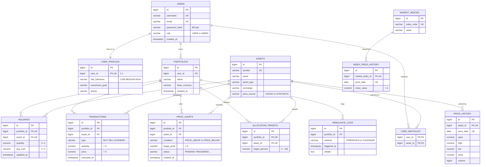
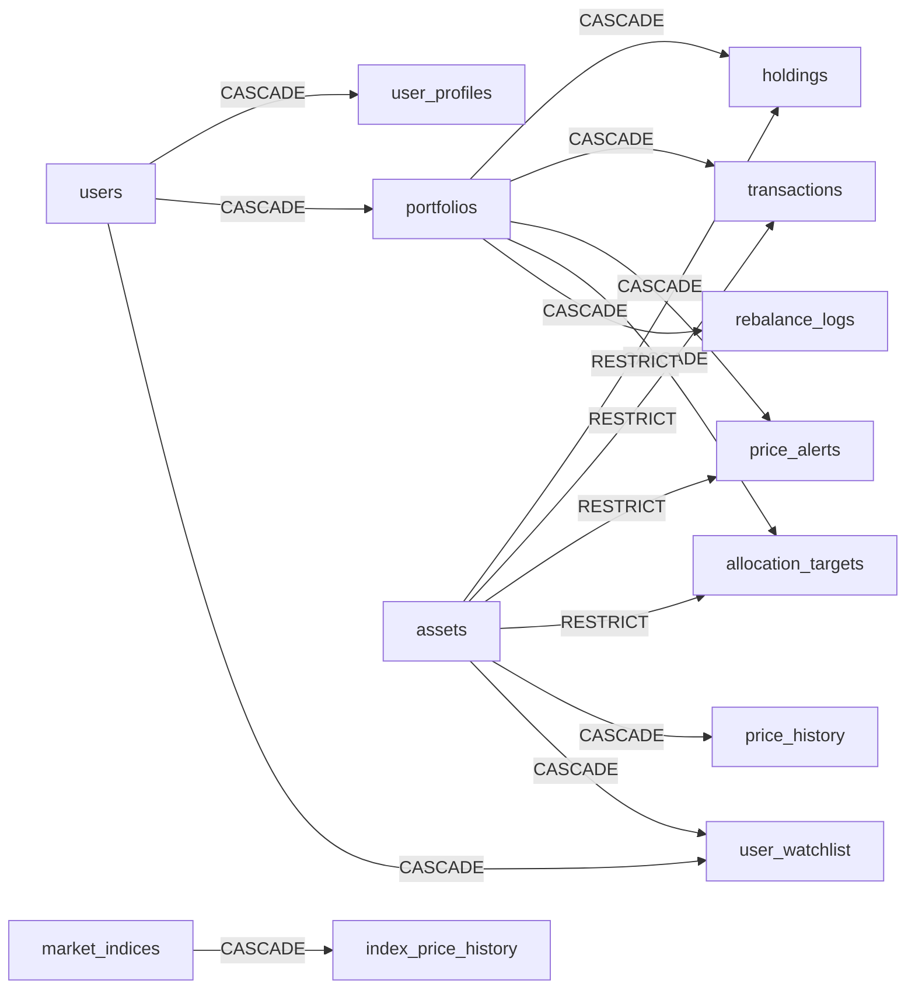

# ER Diagram

ไดอะแกรมนี้วาดตาม [`schema.sql`](../../code/src/main/resources/schema.sql) ซึ่งเป็นต้นฉบับของโครงสร้างตาราง ส่วนคำอธิบายแต่ละคอลัมน์อยู่ใน [`doc/data-dictionary.md`](../data-dictionary.md)

- ระบบมี **13 ตาราง** แบ่งเป็น 12 entity กับตารางเชื่อม `user_watchlist` อีก 1 ตาราง
- **PK** คือ Primary Key, **FK** คือ Foreign Key, **UK** คือคอลัมน์ที่อยู่ใน UNIQUE constraint
- ชนิดตัวเลขในไดอะแกรมย่อไว้ ขนาดจริงดูได้ใน data dictionary เช่น `numeric` ของราคาคือ `NUMERIC(18,4)`

## ความสัมพันธ์

| แบบ | ตาราง | ทำได้อย่างไรในฐานข้อมูล | ฝั่ง JPA |
|---|---|---|---|
| **1:1** | `users` — `user_profiles` | `user_profiles.user_id` เป็น FK และมี UNIQUE (`uq_user_profiles_user_id`) ผู้ใช้หนึ่งคนจึงมีโปรไฟล์ได้แถวเดียว | `@OneToOne` |
| **1:N** | `users` → `portfolios` | `portfolios.user_id` เป็น FK | `@ManyToOne` / `@OneToMany` |
| **1:N** | `portfolios` → `holdings`, `transactions`, `price_alerts`, `allocation_targets`, `rebalance_logs` | ตารางลูกมี FK ชื่อ `portfolio_id` | `@ManyToOne` / `@OneToMany` |
| **1:N** | `assets` → `price_history`, `market_indices` → `index_price_history` | ตารางลูกมี FK และมี UNIQUE (FK, `price_date`) | `@ManyToOne` |
| **N:M** (มีข้อมูลเพิ่ม) | `portfolios` ↔ `assets` ผ่าน `holdings` | `holdings` เก็บจำนวนหน่วยและต้นทุนเฉลี่ยไว้ด้วย จึงเป็น join entity ที่มี PK ของตัวเอง และมี UNIQUE (`portfolio_id`, `asset_id`) | 2 × `@ManyToOne` |
| **N:M** (ล้วน) | `users` ↔ `assets` ผ่าน `user_watchlist` | ตารางเชื่อมมีแค่ 2 FK และใช้ทั้งคู่รวมกันเป็น PK | `@ManyToMany` + `@JoinTable` |

## ไดอะแกรม

ถ้าดูไฟล์นี้ในที่ที่ไม่แสดง Mermaid ให้เปิดภาพ [`er-diagram.png`](er-diagram.png) แทน

## เมื่อลบข้อมูลแม่ (ON DELETE)

- **CASCADE** ใช้กับข้อมูลลูกที่ไม่มีความหมายถ้าไม่มีแม่ เช่น ลบผู้ใช้แล้วพอร์ตและทุกอย่างในพอร์ตต้องหายตาม
- **RESTRICT** ใช้ห้ามลบสินทรัพย์ที่ยังมีคนถือ มีประวัติซื้อขาย มี alert หรือมีเป้าหมายอ้างถึงอยู่ เพราะข้อมูลเหล่านี้เป็นประวัติทางการเงินที่ต้องเก็บไว้

เหตุผลแบบละเอียดอยู่ใน [Data Dictionary — นโยบาย ON DELETE](../data-dictionary.md#นโยบาย-on-delete)
